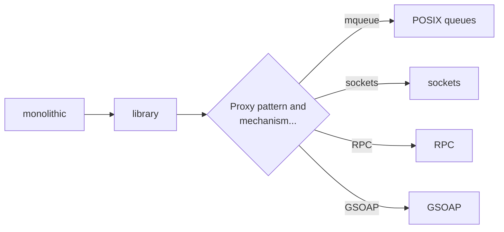
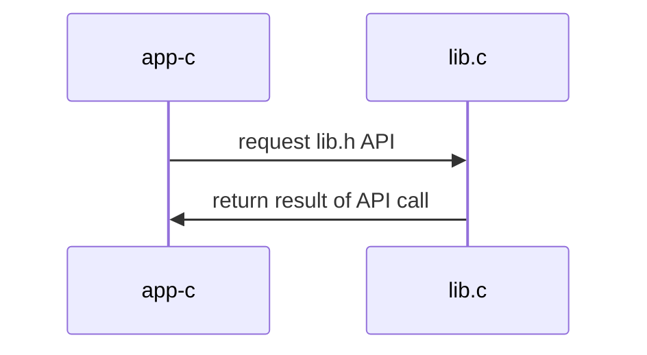
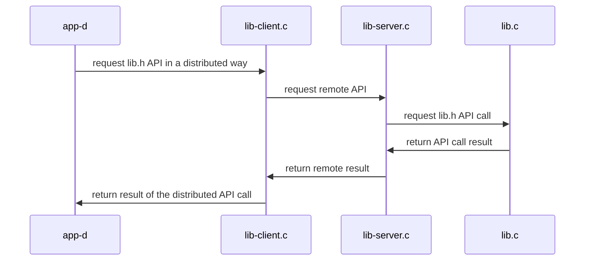

# Example of transforming a monolithic application into a distributed application
+ **Felix Garcia Carballeira and Alejandro Calderon Mateos**
+ [](https://github.com/acaldero/uc3m_ds/blob/main/LICENSE)


## Initial centralized application

We start with an abstraction of a *basic calculator* with the following interface:
```c
  // Add two integers.
  int add ( int a, int b ) ;

  // Subtract two integers.
  int sub ( int a, int b ) ;

  // Change the sign of an integer.
  int neg ( int a ) ;
```

And we have the following function that uses this abstraction:
```c
int main ( int argc, char *argv[] )
{
    int N1 = 20 ;
    int N2 = 10 ;
    int val ;

    // add
    val = add(N1, N2) ;
    printf("%d + %d = %d\n", N1, N2, val) ;

    // sub
    val = sub(N1, N2);
    printf("%d - %d = %d\n", N1, N2, val);

    // neg
    val = neg(N2);
    printf("-%d = %d\n", N2, val);

    return 0;
}
```

This abstraction is initially designed and implemented:
  * In a single source file (monolithic) and
  * Deployed as a single executable (centralized)

The source code, compilation instructions, and execution instructions are in:
  * [Centralized monolithic service](/pc-calculator/cal-centralized-monolithic#readme)

Starting from this initial centralized monolithic version,
to transform it into a distributed service, it is advisable to follow these steps:


The first transformation consists of placing the abstraction in a library and having the main program make use of this library.

For the next transformation, the [proxy pattern](https://en.wikipedia.org/wiki/Proxy_pattern) is important so that the main program believes it is working with a local library when in fact the implementation will be remote.
The local library is actually a stub that communicates with the remote implementation using one of the available communication mechanisms (POSIX queues, sockets, etc.).


## Centralized service with library

This abstraction is initially designed and implemented:
  * In several source files (library + application) and
  * Deployed as a single executable (centralized)

The source code, compilation instructions, and execution instructions are in:
  * [Centralized service with library](/pc-calculator/cal-centralized-library#readme)

The architecture can be summarized as:



## Distributed service based on POSIX queues

This abstraction is initially designed and implemented:
  * In several source files (library and executables) and
  * Deployed as several (distributed) executables using POSIX queues

The source code, compilation instructions, and execution instructions are in:
  * [Distributed service based on POSIX queues](/pc-calculator/cal-distributed-mqueue#readme)

The architecture can be summarized as:



## Socket-based distributed service

This abstraction is initially designed and implemented:
  * In several source files (library and executables) and
  * Deployed as several (distributed) executables using sockets

The source code, compilation instructions, and execution instructions are in:
  * [Distributed socket-based service](/pc-calculator/cal-distributed-sockets#readme)

The architecture can be summarized as:


## RPC-based distributed service

This abstraction is initially designed and implemented:
  * In several source files (library and executables) and
  * Deployed as several (distributed) executables using RPC

The source code, compilation instructions, and execution instructions are in:
  * [Distributed service based on RPC](/pc-calculator/cal-distributed-rpc#readme)

The architecture can be summarized as:


## GSOAP-based distributed service

This abstraction is initially designed and implemented:
  * In several source files (library and executables) and
  * Deployed as several (distributed) executables using GSOAP

The source code, compilation instructions, and execution instructions are in:
  * [GSOAP-based distributed service](/pc-calculator/cal-distributed-gsoap-standalone#readme)

The architecture can be summarized as:


## Additional information

* [Introduction to lab 1](https://www.youtube.com/watch?v=LWeuoihcKyI)
* [Introduction to lab 2](https://www.youtube.com/watch?v=tmFu_JenEi0)

