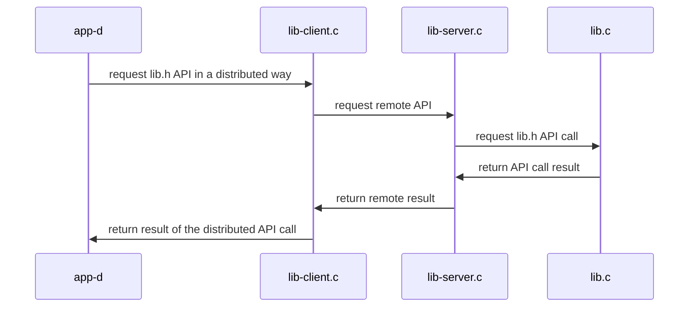

## Distributed Systems: Supplementary Materials
+ **Felix García Carballeira and Alejandro Calderón Mateos** @ arcos.inf.uc3m.es
+ [](https://github.com/acaldero/uc3m_ds/blob/main/LICENSE)


## Distributed service based on POSIX queues

#### To compile

Please, first execute:
```
cd cal-distributed-mqueue
make
```

And the output should be similar to:
```
gcc -g -Wall -c app-d.c
gcc -g -Wall -c lib-client.c
gcc -g -Wall -c lib.c
gcc -g -Wall -lrt app-d.o lib.o lib-client.o       -o app-d  -lrt
gcc -g -Wall -c lib-server.c
gcc -g -Wall    lib.o lib-client.o lib-server.o  -o lib-server  -lrt
```

#### To execute

*TIP: POSIX queues are used to communicate processes on the same machine*

<html>
<table>
<tr><th>Step</th><th>Client</th><th>Server</th></tr>
<tr>
<td>1</td>
<td></td>
<td>

```
$ ./lib-server
```

</td>
</tr>

<tr>
<td>2</td>
<td>

```
$ ./app-d
0 = d_add(30, 20, 10)
0 = d_divide(2, 20, 10)
0 = d_neg(-10, 10)
```

</td>
<td>

```
 0 = d_add(30, 20, 10)
 0 = d_divide(2, 20, 10)
 0 = d_neg(-10, 10)
```

</td>
</tr>

<tr>
<td>3</td>
<td></td>
<td>

```
^Caccept: Interrupted system call
```

</td>
</tr>
</table>
</html>

*TIP: POSIX queues can be viewed from the command line:*

``` bash
sudo mkdir /dev/mqueue
sudo mount -t mqueue none /dev/mqueue
ls -las /dev/mqueue
```

#### Architecture



