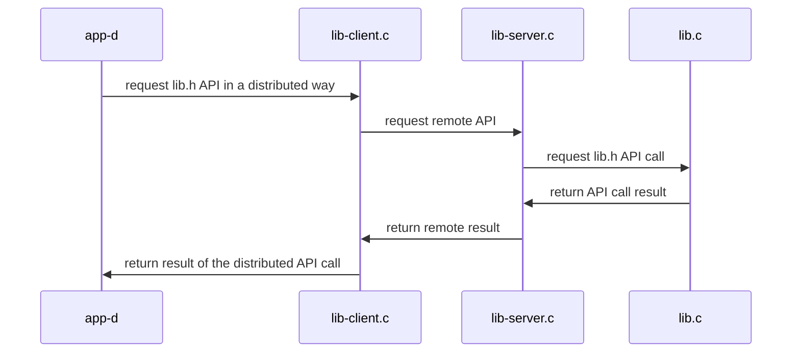

## Distributed Systems: Supplementary Materials
+ **Felix Garcia Carballeira and Alejandro Calderon Mateos** @ arcos.inf.uc3m.es
+ [](https://github.com/acaldero/uc3m_ds/blob/main/LICENSE)


## Distributed service based on RPC

### (0) Initial steps to have RPCs in a Linux distribution compatible with Ubuntu 22.04:

1) Install software and its prerequisites:
   ```
   sudo apt-get install libtirpc-common libtirpc-dev libtirpc3 rpcbind build-essential
   ```
2) Configure software and prerequisites:
   ```
   sudo mkdir -p /run/sendsigs.omit.d/
   sudo /etc/init.d/rpcbind restart
   ```


### (1) Steps to create a distributed application with RPCs:

1) Create the IDL file using XDR language (which is similar to C but not exactly C).
   * Our example of [message.x](message.x) is:
     ```
     struct result
     {
        int value ; /* value to return */
        int status ; /* whether or not the process of obtaining the value to return was successful */
     } ;

     program CALC
     {
        version CALC_VERSION
        {
           struct result d_add ( int a, int b ) = 1 ;
           struct result d_divide ( int a, int b ) = 2 ;
           struct result d_neg ( int a ) = 3 ;
        } = 1 ;

     } = 55555 ;
     ```

2) Use rpcgen with the IDL file:
   * For our example, it is:
     ```
     rpcgen -a -N -M message.x
     ```
   * This command should generate the following files:

     | **File**         | **Should be edited or used as a template**  | **Where it is used**  | **Meaning**   |
     |:-----------------|:-------------------------------------------:|:---------------------:|:--------------|
     | message.h        | No     | Client and server  | Definition of types and functions based on what is indicated in message.x  |
     | message_xdr.c    | No     | Client and server  | Responsible for *marshalling* and *unmarshalling* data                     |
     | message_clnt.c   | No     | Client             | RPC stub or substitute on the client side                                  |
     | message_svc.c    | No     | Server             | RPC stub or substitute on the server side                                  |
     | message_server.c | Yes    | Server             | Skeleton for implementing the interface on the server.<br>Used as a template for lib-server.c  |
     | message_client.c | Yes    | Client             | Example client program that makes RPC calls                                |
     | Makefile.message | Yes    | For compiling      | Template for compilation file.<br>You must add the extra files from the project and check that the options match the project   |

3) Complete the code that rpcgen generates on the **server** side:
   * In the example, you have *lib-server.c + lib.c + lib.h*:
      * **[lib-server.c](lib-server.c)**: implementation of the RPC interface using **message_server.c** as the initial template
      * **[lib.c](lib.c)**: implementation of the interface to be used on the server side
      * **[lib.h](lib.h)**: interface to be used on the server side

4) Complete the code that rpcgen generates on the **client** side:
   * In the example, we have *lib-client.c + lib-client.h + app-d.c*:
      * **[lib-client.c](lib-client.c)**: implementation of the proxy that uses the RPC interface, using fragments of **message_client.c**
      * **[lib-client.h](lib-client.h)**: implementation of the lib.h interface on the client, using **lib.h**
      * **[app-d.c](app-d.c)**: implementation of the client program that uses the lib-client.c interface (the lib.h interface on the client)

5) Create **Makefile.rpc** using **Makefile.message** as a template and check the following aspects:
   * If using Linux Ubuntu 22.04 or compatible, check that CFLAGS and LDFLAGS use tirpc:
     ```
     ...
     CFLAGS  += -g -I/usr/include/tirpc       # add -I/usr/include/tirpc
     LDFLAGS += -lnsl -lpthread -ldl -ltirpc  # add -ltirpc
     ...
     ```
   * Add the additional files needed for the project:
     ```
     TARGETS_SVC.c  = lib-server.c lib.c message_svc.c message_xdr.c
     TARGETS_CLNT.c = app-d.c lib-client.c message_clnt.c message_xdr.c
     ```
   * Rename the executable files:
     ```
     SERVER = lib-server   # message_server
     CLIENT = app-d        # message_client
     ```
   * If **message_server.c** and/or **message_client.c** are modified, then it is best to remove *$(TARGETS)* from the *clean:* rule:
     ```
     clean:
     # $(RM) core $(TARGETS) $(OBJECTS_CLNT) $(OBJECTS_SVC) $(CLIENT) $(SERVER)
       $(RM) core            $(OBJECTS_CLNT) $(OBJECTS_SVC) $(CLIENT) $(SERVER)
     ```
     Otherwise, every time you run "make clean", the modified files will be deleted.


### (2) To compile

* Next, you need to compile:
  ```
  make -f Makefile.rpc
  ```

* And the output should be similar to:
  ```
  gcc -g -Wall -I/usr/include/tirpc -c app-d.c
  gcc -g -Wall -I/usr/include/tirpc -c lib-client.c
  gcc -g -Wall -I/usr/include/tirpc -c message_clnt.c
  gcc -g -Wall -I/usr/include/tirpc -c message_xdr.c
  gcc -g -Wall -I/usr/include/tirpc lib-client.o app-d.o message_clnt.o message_xdr.o -o app-d -lnsl -lpthread -ldl -ltirpc
  gcc -g -Wall -I/usr/include/tirpc -c lib.c
  gcc -g -Wall -I/usr/include/tirpc -c lib-server.c
  gcc -g -Wall -I/usr/include/tirpc -c message_svc.c
  gcc -g -Wall -I/usr/include/tirpc lib-server.o lib.o message_svc.o message_xdr.o -o lib-server -lnsl -lpthread -ldl -ltirpc
  ```


### (3) To run

<html>
<table>
<tr><th>Step</th><th>Client</th><th>Server</th></tr>
<tr>
<td>1</td>
<td></td>
<td>

```
$ ./lib-server
```

</td>
</tr>

<tr>
<td>2</td>
<td>

```
$ env SERVER_IP=localhost ./app-d
0 = add(30, 20, 10)
0 = divide(2, 20, 10)
0 = neg(-10, 10)
```

</td>
<td>

```

```

</td>
</tr>

<tr>
<td>3</td>
<td></td>
<td>

To stop the server, press Control-C:

```
^Caccept: Interrupted system call
```

</td>
</tr>
</table>
</html>


#### Architecture


