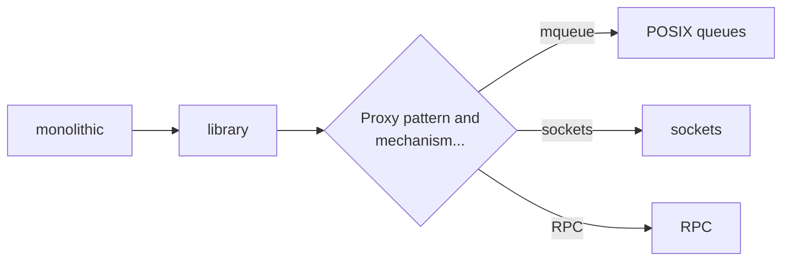
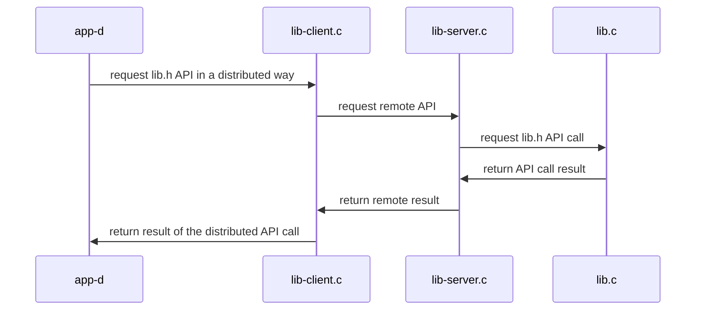

# Example of transforming a monolithic application into a distributed application
+ **Felix Garcia Carballeira and Alejandro Calderon Mateos**
+ [](https://github.com/acaldero/uc3m_ds/blob/main/LICENSE)


## Initial centralized application

We start with an abstraction of *a hash table* with the following interface:
```c
  // Initialize a distributed array of N integers.
  int init ( char *name, int N ) ;

  // Insert the value at position i of the name array.
  int set ( char *name, int i, int value ) ;

  // Retrieve the value of element i of the name array.
  int get ( char *name, int i, int *value ) ;
```

And we have the following function that uses this abstraction:
```c
int main ( int argc, char *argv[] )
{
    int N = 10 ;
    char *A = "name" ;
    int val ;

    // init
    init(A, N);

    // set
    for (int i=0; i<N; i++) {
         set(A, 100+i, i);
    }

    // get
    for (int i=0; i<N; i++) {
         get (A, 100+i, &val) ;
    }

    return 0 ;
}
```

This abstraction is initially designed and implemented:
  * In a single source file (monolithic) and
  * Deployed as a single executable (centralized)

The source code, compilation instructions, and execution instructions are in:
  * [Centralized monolithic service](/pc-keyvalue/kv-centralized-monolithic/README.md#service-centralized-monolithic)

Starting from this initial centralized monolithic version,
to transform it into a distributed service, it is advisable to follow these steps:


The first transformation consists of placing the abstraction in a library and having the main program make use of this library.

For the next transformation, the [proxy pattern](https://en.wikipedia.org/wiki/Proxy_pattern) is important so that the main program believes it is working with a local library when the implementation will actually be remote.
The local library is actually a stub that communicates with the remote implementation using one of the available communication mechanisms (POSIX queues, sockets, etc.).


## Centralized service with library

This abstraction is initially designed and implemented:
  * In several source files (library + application) and
  * Deployed as a single executable (centralized)

The source code, compilation instructions, and execution instructions are in:
  * [Centralized service with library](/pc-keyvalue/kv-centralized-library/README.md)

The architecture can be summarized as:
  ```mermaid
  sequenceDiagram
     app-c ->> lib.c: request lib.h API
     lib.c ->> app-c: return result of API call
  ```


## Distributed service based on POSIX queues

This abstraction is initially designed and implemented:
  * In several source files (library and executables) and
  * Deployed as several (distributed) executables using POSIX queues

The source code, compilation instructions, and execution instructions are in:
  * [Distributed service based on POSIX queues](/pc-keyvalue/kv-distributed-mqueue/README.md)

The architecture can be summarized as:



## Socket-based distributed service

This abstraction is initially designed and implemented:
  * In several source files (library and executables) and
  * Deployed as several (distributed) executables using sockets

The source code, compilation instructions, and execution instructions are in:
  * [Distributed service based on sockets](/pc-keyvalue/kv-distributed-sockets/README.md)

The architecture can be summarized as:


## RPC-based distributed service

This abstraction is initially designed and implemented:
   * In several source files (library and executables) and
   * Deployed as several (distributed) executables using RPC

The source code, compilation instructions, and execution instructions are in:
   * [Distributed service based on RPC](/pc-keyvalue/kv-distributed-rpc/README.md)

The architecture can be summarized as:


## Additional information

* [Introduction to lab 1](https://www.youtube.com/watch?v=LWeuoihcKyI)
* [Introduction to lab 2](https://www.youtube.com/watch?v=tmFu_JenEi0)

