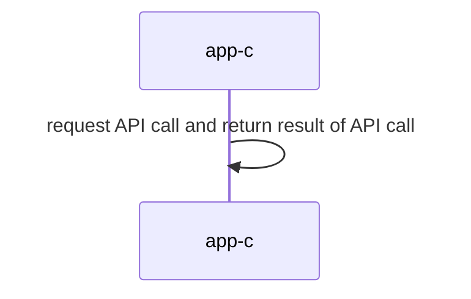

## Distributed Systems: Supplementary Materials
+ **Felix García Carballeira and Alejandro Calderón Mateos** @ arcos.inf.uc3m.es
+ [](https://github.com/acaldero/uc3m_ds/blob/main/LICENSE)


## Centralized monolithic service

### To compile

Please enter:
```
cd kv-centralized-monolithic
make
```

The output should be similar to:
```
gcc -g -Wall -c app-c.c
gcc -g -Wall app-c.o -o app-c
```

### Run

Enter:
```
./app-c
```

And the output should be similar to:
```
set("name", 100, 0x0)
set("name", 101, 0x1)
set("name", 102, 0x2)
...
get("name", 107) -> 0x7
get("name", 108) -> 0x8
get("name", 109) -> 0x9
```

### Architecture



