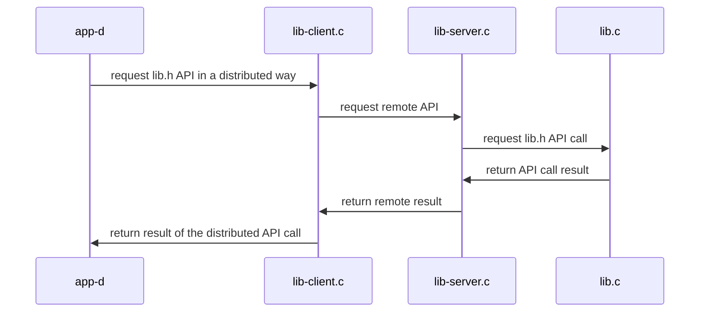

## Distributed Systems: Supplementary Materials
+ **Felix García Carballeira and Alejandro Calderón Mateos** @ arcos.inf.uc3m.es
+ [](https://github.com/acaldero/uc3m_ds/blob/main/LICENSE)


## Distributed service based on sockets

*NOTE: Before running on two different machines, please update the server IP address in the lib-client.c file*

### To compile

Please intro:
```bash
$ cd kv-distributed-sockets
$ make
```

The output should be similar to:
```bash
gcc -g -Wall -c app-d.c
gcc -g -Wall -c lib-client.c
gcc -g -Wall -c lib.c
gcc -g -Wall app-d.o lib.o lib-client.o -o app-d
gcc -g -Wall -c lib-server.c
gcc -g -Wall lib.o lib-client.o lib-server.o -o lib-server
```

### Run

<html>
<table>
<tr><th>Step</th><th>Client</th><th>Server</th></tr>
<tr>
<td>1</td>
<td></td>
<td>

```
$ ./lib-server
```

</td>
</tr>

<tr>
<td>2</td>
<td>

```
$ ./app-d
d_set("name", 1, 0x123)
d_get("name", 1) -> 0x123
```

</td>
<td>

```

1 = init(name, 10);
1 = set(name, 1, 0x123);
1 = get(name, 1, 0x123);
```

</td>
</tr>

<tr>
<td>3</td>
<td></td>
<td>

```
^Caccept: Interrupted system call
```

</td>
</tr>
</table>
</html>


### Architecture




**Additional material**:
* <a href="https://beej.us/guide/bgnet/html/index-wide.html">Beej's Guide to Network Programming</a>
* <a href="https://beej.us/guide/bgnet0/html/index-wide.html">Beej's Guide to Network Concepts (more theory)</a>

