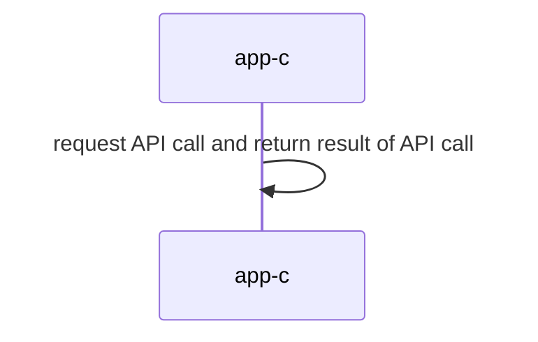

## Distributed Systems: Supplementary Materials
+ **Felix García Carballeira and Alejandro Calderón Mateos** @ arcos.inf.uc3m.es
+ [](https://github.com/acaldero/uc3m_ds/blob/main/LICENSE)


## Monolithic centralized service

### To compile 

Please execute this first:
```
cd cal-centralizado-monolitico
make
```

And the expected output should be:
```
gcc -g -Wall -c app-c.c
gcc -g -Wall app-c.o  -o app-c
```

### To execute

Please execute this:
```
./app-c
```

And the expected output should be similar to:
```
0 = add(30, 20, 10)
0 = divide(2, 20, 10)
0 = neg(-10, 10)
```

### Architecture



