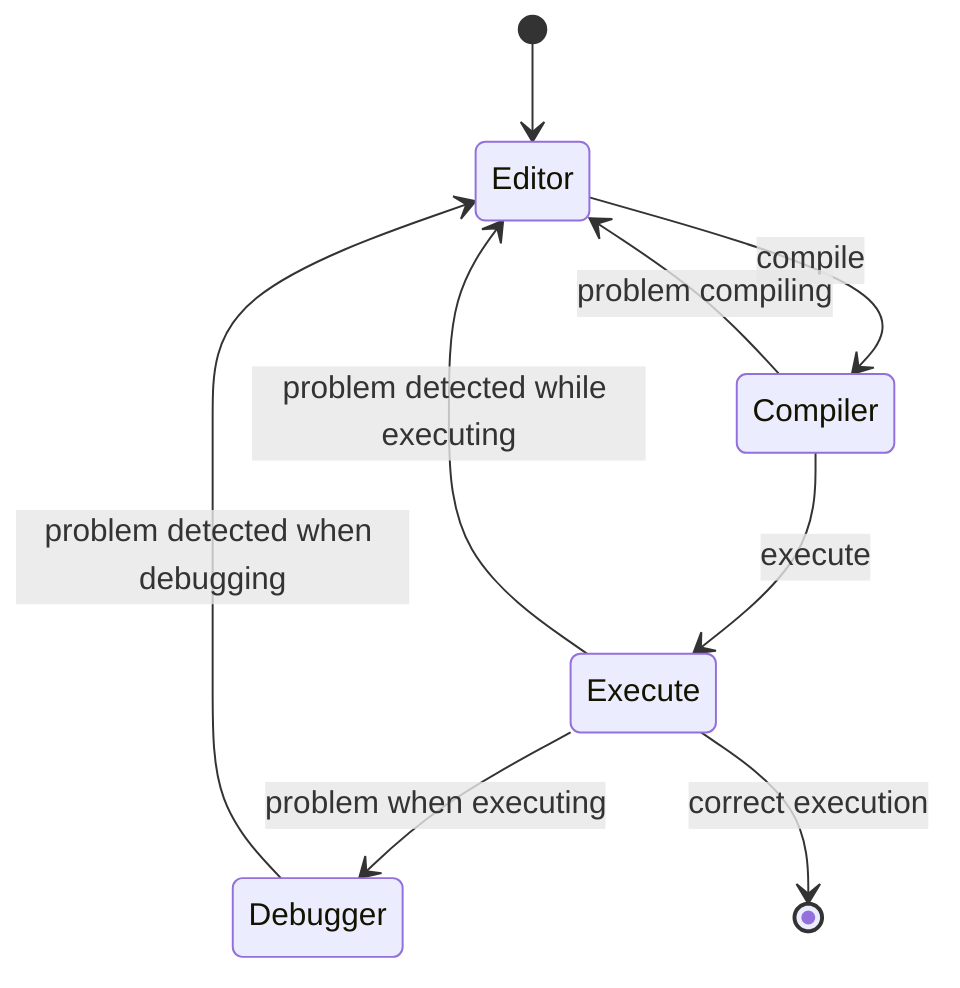

# Summary of the main aspects of the C language for Distributed Systems
+ **Felix García Carballeira, Alejandro Calderón Mateos, and Carlos Gómez Carrasco**
+ [](https://github.com/acaldero/uc3m_sd/blob/main/LICENSE)


## Contents
 
* [Requirements](#requirements)
* A. Usual workflow:
  * [Compilation and execution process](#a1--compilation-and-execution-process)
  * [Debugging](#a2-and-if-there-are-problems-we-debug)
* B. Organized control statements:
  * [Control statements](#b1--flow-control-statements-in-c)
  * [Organized alternative statements](#b2--organized-control-statements)
* C. Registers in C and peculiarities:
  * [struct in C](#c1--use-of-structures-struct-in-c)
  * [Peculiarities of using struct](#c2--special-features-of-structures-struct-in-c)
* D. Pointers:
  * [What is a pointer?](#d1--use-of-pointers-i-what-is-a-pointer)
  * [Dynamic memory](#d2--using-pointers-ii-dynamic-memory)
  * [Passing parameters](#d3--using-pointers-iii-passing-parameters-to-functions)
* E. Multi-file projects: dynamic and static libraries:
  * [Header files and multi-file projects](#e1--header-files-and-multi-file-projects)


## Requirements

The main requirements are:
* An Internet connection to consult documentation.
* Access to a machine running Linux.
  * -> Please note that the Computer Science Department Laboratory offers Virtual Classrooms at:<br> [ "https://www.lab.inf.uc3m.es/servicios/aulas-virtuales-del-laboratorio/](https://www.lab.inf.uc3m.es/servicios/aulas-virtuales-del-laboratorio/)
* Have the necessary development software installed on the Linux machine:
  ```bash
  sudo apt-get install build-essential gdb ddd
  ```


## A. Usual workflow

## A.1.- Compilation and execution process

* The standard C language is compiled (and not interpreted like Python).
  * You must first compile the source code to generate executable code before executing.

* **If everything goes well**, the general workflow is:
  ```mermaid
    stateDiagram-v2
    direction LR
    state "Editor"         as s_edit
    state "Compiler"       as s_cc
    state "Loader"         as s_exe

    [*]       --> s_edit:   edit   <br>-><br>  gedit main.c &
    s_edit    --> s_cc:     compile <br>-><br>  gcc -o main ...
    s_cc      --> s_exe:    execute <br>-><br>  ./main
    s_exe     --> [*]:      execution<br> successful
  ```

As an example, we will use the following file:
* main.c
  ```c
  #include <stdio.h>

  int main ( int argc, char *argv[] )
  {
     printf(“Hello world... %d\n”,
     /*                      ^        */
     /*                      |        */
                           argc) ;

     return 0 ;
  }
  ```

To compile, we will use:

```bash
gcc -g -Wall -c main.c -o main.o
gcc -g -Wall -o main      main.o
```

* <details>
  <summary>About -g, -Wall, ... (click here)</summary>

  * When compiling, the following modifiers (flags) are used:
    * "-g" to add debugging information that is useful if a debugger is used
    * "-Wall" to display all warnings (Warnings) of possible problems detected by the compiler
  * You could also use:
    * "-Werror" to indicate that all warnings should be treated as errors.
    * "-std=c90 -pedantic" to indicate that the C90 standard should be used strictly without additional GNU extensions.

  </details>

To run, we will use:

```bash
./main
```


## A.2 And if there are problems... we debug

The premise is that everything goes well and there are no problems.
But our job includes dealing with problems to solve them in the best way possible.
Common problems arise:
* When compiling: compilation errors due to incorrect syntax in the .c source file
  * <details>
    <summary>Recommendations for debugging compilation problems... (click here)</summary>

    * Try to fix the first error that appears and then recompile (some errors depend on others)
    * Read the compiler error messages carefully, trying to understand what problem the compiler is indicating:
      * First look at the line indicated in the compiler...
      * ...there may be an error in the code on line X that manifests itself to the compiler as another error on subsequent lines
    </details>
* When executing: execution errors because the expected behavior is not the same as the actual behavior.
  * <details>
    <summary>Recommendations for debugging execution problems... (click here)</summary>

      * Use “brute force” with print messages (small programs and/or use of threads):
        * Message of the points where the execution passes: ```printf(“Here 1\n”); ... printf(“Here 2\n”); ...```
        * Message of the status of the variables between two previous points: ```printf(“variable: %d\n”, int_value); ....```
      * Use a debugger (kdbg, ddd, gdb, ...)
      * Perform “defensive” programming: from the beginning, add all possible checks and print messages
    </details>

The general work process, including problem handling, would generally be:


<details>
  <summary>Debug with ddd... (click here)</summary>
<br>

* To debug with ddd, run:
```bash
ddd ./main &
```

* The ddd application is a graphical interface for the command line gdb debugger, making it easier to use:

 
* It can be installed on Debian/Ubuntu using:
   ```bash
   sudo apt-get install ddd
   ```

</details>


<details>
  <summary>Debugging with seer... (click here)</summary>
  <br>

  * NOTE: I would like to take this opportunity to thank Adolfo for the information about seer and recommend its use
  * 
  * Seer is available at:
    https://github.com/epasveer/seer

  * Seer is a graphical interface for gdb on Linux:
  

</details>


<br>

## B. Organized control statements

## B.1.- Flow control statements in C

As an example of the use of flow control statements in C, we will use the following file:
* main.c
  ```c
  #include <stdio.h>

  int main ( int argc, char *argv[] )
  {
     int i ;

     if (NULL == argv)  {
         printf("argv is NULL 🦖\n") ;
     }

     for (i=0; i<argc; i++)
     {
        printf(" argv[%d] -> %s\n", i, argv[i]) ;
     }
     
     return 0 ;
  }
  ```

This example allows you to print the arguments with which a program is invoked.

```bash
gcc -g -Wall -c main.c -o main.o
gcc -g -Wall -o main      main.o

./main one two three
```

Reminders:
* <details>
  <summary>To “switch” between options in C... (click here)</summary>

  * if-then-else:
    ```c
    if ("true or false condition")  // 0 is false and the rest is true
    {
        "if true then..."
    }
    else
    {
        "if false then..."
    }
    ```
  
  </details>
* <details>
  <summary>To "iterate" in C... (click here)</summary>

  * for (from 0 to n times):
    ```c
    for ("initial counter values"; "condition for maintaining in the loop"; "counter update")
    {
       ...
    }
    ```
  * while (from 0 to n times):
    ```c
    "initial counter values";
    while ("condition for maintaining the loop")
    {
       ...
       "counter update" ;
    }
    ```
  * do-while (from 1 to n times):
    ```c
    "initial counter values";
    do
    {
       ...
       "counter update";
    }
    while ("condition for maintaining the loop")
    ```
  </details>


**Recommended information**:
  * [Control statements (YouTube)](http://www.youtube.com/watch?embed=no&v=ux_J98WmjPA&feature=related)


## B.2.- Organized control statements

One of the uses of “alternative” control statements is for “defensive” programming: defensive" programming:
* It checks that all arguments have correct values.
* It checks for every call to the operating system to see if it has returned an error value.

On the left is an example ```main-v1.c``` of a program that saves a message ten times in a file whose name is indicated in the argument without performing any checks.<br>
On the right is ```main-v2.c``` with “defensive” programming.

<html>
  <table>
  <tr>
  <td>
   
  ```c
    #include <stdio.h>


    int main ( int argc, char *argv[] )
    {
       int   i ;
       FILE *fd ;

       fd = fopen(argv[1], "w") ;
       
       for (i=0; i<10; i++) {
            fprintf(fd, "Hello world\n") ;
       }

       fclose(fd) ;

       return 0 ;
    }


   ```

  </td>
  <td>

   ```c
   #include <stdio.h>
   #include <stdlib.h>

   int main ( int argc, char *argv [] )
   {
      int   ret, i ;
      FILE *fd ;

      // check arguments
      if (1 == argc) {
          printf("Usage: %s <file.txt>\n", argv[0]) ;
          exit (-1);
      }

      // try to open file
      fd = fopen(argv[1], "w");
      if (NULL == fd) {
          perror("fopen: ");
          exit(-1);
      }
      
      // do task
      for (i=0; i<10; i++) {
           ret = fprintf(fd, "Hello world\n");
           if (ret < 0) {
               perror("fprintf: ");
           }
      }
      
      // cleanup
      ret = fclose(fd) ;
      if (ret < 0) {
          perror("fclose: ") ;
      }

   return 0 ;
   }
   ```

</td>
</tr>
</table>
</html>

When compiling and executing, you get the following:

<html>
  <table>
  <tr>
  <td>

* To compile the initial version ```main-v1.c```:
  ```bash
  gcc -g -Wall -c main-v1.c -o main-v1.o
  gcc -g -Wall -o main-v1      main-v1.o
  ```

* To execute ```main-v1``` with and without arguments:
  ```bash
  ./main-v1 file.txt
  ./main-v1
  ```

* But ```main-v1``` without parameters does not execute:
  ```bash
  Segmentation fault (core dumped)
  ```
  
  </td>
  <td>

* To compile the “defensive” version ```main-v2.c```:
  ```bash
  gcc -g -Wall -c main-v2.c -o main-v2.o
  gcc -g -Wall -o main-v2      main-v2.o
  ```

* To run ```main-v2``` with and without arguments:
  ```bash
  ./main-v2 file.txt
  ./main-v2
  ```

* And without arguments, there is no serious error:
  ```bash
  Usage: ./main-v2 <file.txt>
  ```


</td>
</tr>
</table>
</html>


Two details to remember:
* 1. Avoid nesting if-else statements to detect errors because it makes the code difficult to read and understand.
  Example:
  ```c
    if (**error case X**)
    {
        printf("ERROR: **explanation**") ;
    }
    
    else
    {
        if (**error case Y**)
        {
            printf("ERROR: **explanation**") ;
        }
        else
        {
             if (**error case Z**)
             {
                 printf("ERROR: **explanation**") ;
             }
             else
             {
                  **more code ...**
             } 
        }
    }
  ```
* 2. Check the value returned by all system calls (you can use ```perror``` or similar to report the reason for the error):
  ```c
    fd = fopen(argv [1], "w");
    if (NULL == fd)
    {
        perror("fopen: ");
    }
  ```


<br>

## C. Records in C and peculiarities

## C.1.- Use of structures (struct) in C

As an example of (array of) structs, we will use the following file:
* main.c
  ```c
  #include <stdio.h>
  #include <stdlib.h>

  #define N_PERSONAS 10
  
  struct dni {
     int  id ;
     char letter ;
     char name[128] ;
  } ;

  struct dni people[N_PEOPLE] ;

  int main ( int argc, char *argv[] )
  {
     int i ;

     /* Fill people with default values (person 0,1...) */
     for (i=0; i<N_PERSONAS; i++)
     {
        personas[i].id    = i ;
        personas[i].letter = 'A' ;
        sprintf(personas[i].name,  /* destination string */
                "person %d",       /* format */
                people[i].id);     /* %d */
     }
  
     /* Print people */
     for (i=0; i<N_PEOPLE; i++)
     {
        printf(" * Person '%s' with id '%d' and letter '%c'.\n",
               people[i].name,
               people[i].id,
               people[i].letter) ;
     
     }

     return 0 ;
  }
  ```

Clarifications:
* About arrays:
  * When using an array with only its name (without square brackets []), we will have the memory address of the first element
    * array == &(array[0])
    * It is a constant memory address (determined at compile time) that points to a variable element (it can change at runtime).
  * There is no string type already included in C, but we can use a character array to represent a string of a maximum length predefined at compile time:
    ```c
    char string1[128]; // string of up to 127 characters plus end-of-string character ('\0') to indicate the last

    strcpy(string1, "Hello world") ;
    ```
* About structs:
  * When defining a structure type with ```struct structure-type-name``` we must always use the word struct in the type name to define variables: ```struct struct-type-name variable```
  * It is possible to create a new data type from others with typedef:
    ```c
    typedef   struct dni     hundred_people[100] ;
    hundred_people  staff ;
    ```
  * It is possible not to always have to use “struct” when creating a new data type with typedef:
    ```c
    typedef   struct dni     dni_t ;
    dni_t personas[N_PERSONAS] ;
    ```

**Recommended information**:
* [Arrays and Structs in C (YouTube)](http://www.youtube.com/watch?embed=no&v=o5Jl_Dzga88&feature=related)


## C.2.- Special features of structures (struct) in C

As an example of structs, we will use the following file:
* main.c
  ```c
  #include <stdio.h>
  #include <stdlib.h>
  #include <string.h>

  struct dni {
     int  id ;
     char letter ;
     char name[128] ;
  } ;
  
  struct dni personas ;

  int main ( int argc, char *argv[] )
  {
     /* Fill personas with default values (person 0,1...) */
     personas[i].id    = i ;
     personas[i].letra = 'A' ;
     sprintf(people[i].name,   /* destination string */
             "person %d",      /* format */
             people[i].id);    /* %d */

     /* The size of a struct may not be the sum of the sizes of its fields: there may be padding */
     printf("* Size of DNI type vs. sum of field sizes:\n");
     printf("  + Size in bytes of DNI type: % ld\n", sizeof(struct dni)) ;
     printf("  + Size in bytes of the fields of the DNI type: %ld, %ld, %ld\n",
                 sizeof(people.name), sizeof(people.letter), sizeof(people.id)) ;

     /* The size of a string is not its length */
     printf("* Size of the character string is not the length:\n"); 
     printf("  + Size in bytes of the string: %ld\n", sizeof(people.name));
     printf("  + Length of the string:        %ld\n", strlen(people.name));

     return 0;
  }
  ```

There are two types of particularities to remember:
1. *Endianess*
   * Integer types with more than one byte (e.g., integer) can have different byte orders: *big endian* vs *little endian*.
2. Sizes in bytes...:
   * The size of the struct is NOT always the sum of the sizes of the fields: there may be padding to align data types in memory.
     * Tip: the size of “struct X” is obtained with “sizeof(struct X)”
   * The size of an integer in C is not portable: on a 32-bit platform it is different from that on a 64-bit platform
     * Tip: it is better to use [https://en.cppreference.com/w/c/types/integer.html](fixed types) such as ```int32_t```, ```int64_t```, etc.
   * The size of a character array is the space reserved in memory, whether or not it is all used:
     * Tip: differentiate between *sizeof(string)*, *strlen(string)*, and *strlen(string)+1* depending on the context.


<br>

## D. Pointers

## D.1.- Use of pointers I (what is a pointer)

As an initial example of what a pointer represents in C, we will use the following file:
* main.c
  ```c
  #include <stdio.h>
  #include <stdlib.h>
  int main ( int argc, char *argv[] )
  {
      /* Define variables */
      int   i ;
      int *pi ;     /* (1) */
   // int &ri = i ; /* (2) <- only in C++ */
  
      /* Modify variable values */
       i  = 5 ;
       pi = &i ;     /* (4) */
      *pi = 5 ;      /* (3) */
   //  ri = 5 ;      /* <- only in C++ */
  
      /* Check variable values */
       printf("  i = %d\n",   i) ;
       printf(" pi = %x\n",  pi) ;
       printf("*pi = %d\n", *pi); /* (3) */
    // printf(" ri = %d\n",  ri); /* <- only in C++ */
   
      // A pointer variable is a variable that stores the address of a memory location.
      // It is very similar to a variable of type "unsigned long int."
      printf(" pi = %x\n",  pi);
      printf(" &i = %x\n",  &i) ; /* (4) */
      // A pointer variable is in turn stored in a memory location
      // (the & operator can be applied to find out that address)
      printf("&pi = %x\n", &pi) ; /* (4) */
   
      return 0 ;
  }
  ```

Remember:
* The use of the “&” and “*” operators depends on the context:

| context/operator          |   *                 |   &                       |
|:-------------------------:|:-------------------:|:-------------------------:|
| when defining a variable  | (1) pointer to...   | (2) reference to... (C++) |
| variable usage            | (3) accessing...    | (4) the address of...     |

**Recommended information**:
* [Introduction to pointers  I (YouTube)](http://www.youtube.com/watch?embed=no&v=iQF-2vUNEJk&feature=related)
* [Introduction to pointers II (YouTube)](http://www.youtube.com/watch?embed=no&v=m6sdKI3zhKg&feature=related)


## D.2.- Using pointers II (dynamic memory)

As an example of using pointers for dynamic memory, we will use the following file:
* main.c
  ```c
  #include <stdio.h>
  #include <stdlib.h>
  
  void print ( int *vector, int n_elements )
  {
      int i ;

      for (i=0; i<n_elements; i++)
      {
           printf(" >> vector[%d] = %d\n", i, vector[i]) ;
      }
  }
  
  int main ( int argc, char *argv[] )
  {
      /*
       * Static array
       */

      /* Define static array (fixed size, at compile time) */
      int  earray[5]  = { 1, 2, 3, 4, 5 } ;

      /* Modify variable values */
        earray[0] = 1 ;   earray[1] = 2 ;   earray[2] = 3 ;   earray[3] = 4 ;   earray[4] = 5 ;
      *(earray+0) = 1 ; *(earray+1) = 2 ; *(earray+2) = 3 ; *(earray+3) = 4 ; *(earray+4) = 5 ;

  /* CAUTION:
      earray[5] = 5 ;  !!  out of range
  */
  
      /* Check variable values */
      printf("Static:\n");
      print(earray, 5);


      /*
       * Dynamic array
       */

      /* Define dynamic array (variable size set at runtime) */
      int *darray  = NULL;
      int n_elements = 0;

          /* a) Let's request memory for 2 integers... */
          n_elements = 2;
          darray = malloc(n_elements * sizeof(int));
          if (NULL == darray) {
              perror("malloc has failed: ");
              exit(-1);
          }
      
      /* Modify variable values */
        darray[0] = 1 ;   darray[1] = 2 ;
      *(darray+0) = 1 ; *(darray+1) = 2 ;

  /* CAUTION:
      darray     = 1 ;  !!  darray stores memory address 0x1 but does not save 1 in the first element
      darray [2] = 3 ;  !!  out of range
  */

      /* Check variable values */
      printf("Dynamic:\n");
      print(darray, n_eltos);

  /* CAUTION:
     print(&darray, n_eltos);  !! address of the variable that stores the address of the first element...
  */

            /* b) the memory is freed when it is NO longer needed */
            free(darray);
            darray = NULL;
            n_eltos = 0;

     return 0;
  }
  ```

In this example:
* There is a static array (earray) of integers:
  * A static array has a fixed size determined at compile time.
  * Its size cannot be changed at runtime, so a maximum size is usually specified at compile time that the programmer must not exceed.
* There is a dynamic array (darray) of integers:
  * The dynamic array is implemented with two elements: an integer with the size of the array (in elements or bytes) and a pointer to the first element (the rest follow).
  * At runtime, space is reserved (malloc) and then it can be used as a static array (using square brackets and the index of the element to be accessed).

To remember in C:
* **You must keep track of pointers when using them**:
  * **Address**: is it valid?
  * **Pointed space**: has it been previously reserved (at compile or runtime)?
* States in the recommended use of a pointer:
  ```mermaid
    stateDiagram-v2
    direction TB
    state "px==?"              as px_xx
    state "px==NULL"           as px_null
    state "px==&x"             as px_atx
    state "px -> alloc(size)"  as px_alloc

    px_xx     --> px_null:  px = NULL
    px_null   --> px_atx:   px = &x
    px_atx    --> px_null:  px = NULL
    px_null   --> px_alloc: px = malloc(size_in_bytes)
    px_alloc  --> px_null:  free(px) + px = NULL
    px_alloc  --> px_alloc: px_aux = realloc(px, new_size_in_bytes) +\n if (px_aux != NULL) px = px_aux
    px_atx    --> px_alloc: px = malloc(size_in_bytes)
  ```

**Recommended information**:
 * [Introduction to Pointers  I (YouTube)](http://www.youtube.com/watch?embed=no&v=iQF-2vUNEJk&feature=related)
 * [Introduction to Pointers II (YouTube)](http://www.youtube.com/watch?embed=no&v=m6sdKI3zhKg&feature=related)


## D.3.- Using pointers III (passing parameters to functions)

It is important to keep in mind that in the C language:
* The values used to call a function are called **actual arguments**:
  ```c
  int ret = f(1, ‘a’, 3.14) ;
  ```
* The values within a function are called **formal arguments**:
  ```c
  int f(int a1, char a2, float a3) { ... }
  ```
* **When a function is called, the actual arguments are assigned (copied) to the formal arguments**.
  * Therefore, **EVERY argument is passed by value**.
* The name of an array of type X is equivalent to the memory address where the first element of type X is stored
  * Therefore, the formal argument for an array of type X can be a pointer to X.
  ```c
        int f(char *a4, char a5[]) ;
       //           ^        ^
       //           |        |
  int ret = f(array_char, “Hello”) ;
  ```


As an example of passing parameters by value, we will use the following file:
* main.c
  ```c
  #include <stdio.h>
  #include <stdlib.h>
  
  int print_char ( char value )
  {
      printf("value: '%c'\n", value) ;

      return 1 ; // convention here: 1 OK and 0 KO
  }
  
  int print_string ( char *value )
  {
      // check arguments: “defensive” programming...
      if (NULL == value)
          return 0 ;

      // if everything is OK, perform action and return OK
      printf("value: '%s'\n", value);

      return 1; // convention here: 1 OK and 0 KO
  }

  int copy_string ( char * dest, char * orig )
  {
      // check arguments: "defensive" programming...
      if (NULL == dest) return 0 ;
      if (NULL == orig) return 0 ;

     // copy character by character...
     for (int i=0; orig[i] != '\0'; i++) {
           dest[i] = orig[i] ;
       // *dest = *orig ; orig++; dest++ ;
     }

     return 1 ; // convention here: 1 OK and 0 KO
  }

  int main ( int argc, char *argv[] )
  {
      int ret ;
      char  c  = 'x' ;
      char *s1 = "Hello" ;
      char s2[120];

      /* Character (char) */
      ret = print_char(c);
      if (ret != 1) return -1; 

      ret = print_char('x');
      if (ret != 1) return -1;

   /* Character string (string) */
      ret = print_string(s1);  // remember: s1 == &(s1[0])
      if (ret != 1) return -1;

      ret = print_char(s1[3]); // remember: s1[3] == *(s1+3)
      if (ret != 1) return -1;
         
      ret = copy_string(s2, “Hello”);
      if (ret != 1) return -1;

      ret = print_string(s2);  // remember: s2 == &(s2[0])
      if (ret != 1) return -1;
         
      ret = print_char(s2[3]); // remember: s2[3] == *(s2+3)
      if (ret != 1) return -1;
      
     return 0; // convention here: 0 OK, negative values KO
  }
  ```

**Recommended information**:
* [Passing parameters to functions (YouTube)](https://youtu.be/mS0gnJ-su_Y&t=7m33s)


As an example of passing pointer parameters by reference, we will use the following file:
* main.c
  ```c
  #include <stdio.h>
  #include <stdlib.h>

  // the long size parameter is a long integer passed by value
  void * my_malloc ( long size )
  {
      // check arguments...
      if (0 == size) return NULL ;

      return (void *)malloc(size) ;
  }

  // the ptr parameter is a pointer to void passed by reference
  int my_free ( void **ptr )
  {
    // check arguments...
    if (NULL == ptr) return -1 ; // error

    // if it is already NULL, ignore
    if (NULL == *ptr) return 0 ; // ignore

    // free and set to NULL
    free(*ptr) ;
    *ptr = NULL ;

    return 1 ; // OK
  }
  
  // the ptr parameter is a void pointer passed by reference
  int  my_remalloc ( void **ptr,  long new_size )
  {
      void * ptr_aux ;

      // check arguments...
      if (NULL == ptr) { // (NULL != ptr) vs (ptr != NULL)
          return -1 ; // error
      }

      // new_size == 0 -> free(...)
      if (0 == new_size) {
          if (*ptr) free(*ptr) ;
          *ptr = NULL ;
          return 1 ;
      }
      
      // new_size != 0 -> realloc(...)
      ptr_aux = realloc(*ptr, new_size);
      if (NULL != ptr_aux) {
         *ptr = ptr_aux;
         return 1 ;
      }
      
      return -1; 
  }

  int main(int argc, char *argv[])
  {
     int ret;
     char *s1;

     s1 = my_malloc(128 * sizeof(char));

         // print string "a"
         s1[0] = 'a';
         s1[1] = '\0';
         printf("%s\n", s1);

      // keep same content in s1 but request more allocated space
      ret = my_remalloc(&s1, 256 * sizeof(char));

         // ...
  
      ret = my_free(&s1);

      return 0;
  }
  ```

**Recommended information**:
* [Passing parameters to functions (YouTube)](https://youtu.be/mS0gnJ-su_Y&t=7m33s)


<br>

## E. Multi-file projects: dynamic and static libraries

## E.1.- Header files and multi-file projects

As an example of how to compile a multi-file project, we will use these three files:

* lib_hello.h
  ```c
  // NOTE: "save" to avoid including the same library more than once due to "transitive" imports
  #ifndef LIB_HELLO
  #define LIB_HELLO
      
  #include <stdio.h>

      // NOTE: only "declarations" (e.g.: external int err_code;) and not "definitions" (e.g.: int err_code = 0;)
      void di_hola ( void ) ;

  #endif
  ```

* lib_hello.c
  ```c
  // NOTE: the preprocessor replaces “#include” with the contents of the header file
  #include "lib_hello.h"

  void say_hello ( void )
  {
      printf("Hello World...\n");
  }
  ```

* main.c
  ```c
  // NOTE: the preprocessor replaces "#include" with the contents of the header file
  #include "lib_hello.h"
  
  // NOTE: using #include <file> only searches the system headers,
  //       #include "file" also searches directories defined by the programmer (a)
  //       with the argument -Idirectory when compiling
  #include <stdlib.h>

  int main ( int argc, char *argv[] )
  {
      di_hello() ;

      return 0 ;
  }
  ```


There are three main compilation alternatives:
* (1/3) Example of compiling the main executable (without libraries):
  ```bash
  gcc -g -Wall -c lib_hello.c -o lib_hello.o
  gcc -g -Wall -c main.c     -o main.o      -I./
  gcc -g -Wall -o main main.o lib_hello.o
  ```
  
  <details>
    <summary>Where the compilation options... (click here)</summary>

    * "-c ... -o ..." generates the binary file associated with a source file:
      ```bash
      gcc -g -Wall -c file.c -o file.o
      ```
    * "-o ... libs..." generates the executable file by combining all the binaries (including libraries such as libc.a with -lc):
      ```bash
      gcc -g -Wall -o file file.o lib_hello.o -lc
      ```
  </details>
* (2/3) Example of compilation with static library for lib_hello.o:
  ```bash
  gcc -g -Wall -c lib_hola.c -o lib_hola.o
  ar rcs libstatic.a lib_hola.o
  gcc -g -Wall -o main main.c -lestatic -L.
  ./main
  ```
* (3/3) Example of compilation with dynamic library for lib_hola.o:
  ```bash
  gcc -g -Wall -fPIC -c lib_hello.c -o lib_hello.o
  gcc -shared -Wl,-soname,libdynamic.so -o libdynamic.so lib_hello.o
  gcc -g -Wall -o main main.c -ldynamic -L.
  env LD_LIBRARY_PATH=$LD_LIBRARY_PATH:. ./main
  ```
  <details>
    <summary>Options for compiling with a dynamic library... (click here)</summary>

    * Example of compilation with versions for the dynamic library:
      ```bash
      gcc -g -Wall -fPIC -c lib_hola.c -o lib_hola.o
      gcc -shared -Wl,-soname,libdinamica.so -o libdinamica.so.1.0 lib_hola.o
      ln -s libdynamic.so.1.0 libdynamic.so
      gcc -g -Wall -o main main.c -ldynamic -L.
      env LD_LIBRARY_PATH=$LD_LIBRARY_PATH:. ./main
      ```
    * Example of saving the current directory in the executable to search for the dynamic library (-Wl,-rpath,*directory*):
      ```bash
      gcc -g -Wall -o main main.c -ldinamica -L. -Wl,-rpath,.
      ```
  </details>


**Recommended information**:
  * [Library example (YouTube)](https://youtu.be/B_7jBxe_VOQ&t=2m34s)
  * [Solving multiple inclusions (YouTube)](https://youtu.be/B_7jBxe_VOQ&t=5m04s)
  * [Example of static libraries (YouTube)](https://youtu.be/B_7jBxe_VOQ&t=7m42s)
  * [Example of dynamic libraries (YouTube)](https://youtu.be/B_7jBxe_VOQ&t=10m05s)
  * [Beej's Guide to C Programming](https://beej.us/guide/bgc/)
* <details>
  <summary>Additional slides and videos... (click here)</summary>
  <html>
  <small>
  <table>
  <tr><th>Session</th><th>Topic</th><th>:notebook: Slides</th><th>:clapper: Videos</th></tr>
  <tr><td rowspan="2">1</td>
      <td>Introduction to <br>Linux/Ubuntu</td>
      <td><ul>
        <li> <a href="https://acaldero.github.io/uc3m_so/transparencias/clase_w0-ubuntu-instalacion.pdf">instalacion.pdf</a></li>
        <li> <a href="https://acaldero.github.io/uc3m_so/transparencias/clase_w0-ubuntu-fichydirs.pdf">ficheros-y-directorios.pdf</a></li>
        <li> <a href="https://acaldero.github.io/uc3m_so/transparencias/clase_w0-ubuntu-procesos.pdf">process-management.pdf</a></li>
      </ul></td>
      <td><ul type="1">
        <li><a href="https://www.youtube.com/watch?v=MwfB9lnB0_A">Installing Ubuntu</a></li>
        <li><a href="https://youtu.be/2U5bJKUX_6s">Files and directories in command lines</a></li>
        <li><a href="https://youtu.be/ym3BeppIE8I">Command line job and process management</a></li>
      </ul></td>
  </tr>
  <tr><td>Introduction to <br>C language</td>
      <td><ul>
        <li> <a href="https://acaldero.github.io/uc3m_so/transparencias/clase_w1-introduccionc.pdf">introduction-to-c.pdf</a></li>
      </ul></td>
      <td>
      <ul type="1">
        <li><a href="https://www.youtube.com/watch?v=EFEj13YU7I0&list=PLEIHi6crVts7HIrUr88SSJsFJC3scIKlA">Introduction to C</a></li>
      </ul>
      </td>
  </tr>
  </table>
  </small>
  </html>
  </details>
