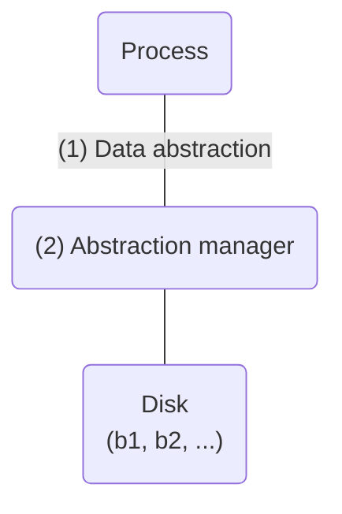
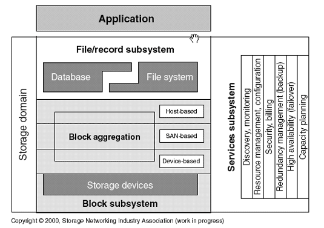

# Distributed file systems
+ **Felix García Carballeira and Alejandro Calderón Mateos** @ arcos.inf.uc3m.es
+ [](https://github.com/acaldero/uc3m_ds/blob/main/LICENSE)


## Contents

* Introduction to distributed file systems:
  * [File system](#file-system)
  * [Basic operation of a file system](#basic-operation-of-a-file-system)
  * [Basic architecture of a file system](#basic-architecture-of-a-file-system)
  * [Possible options for remote storage](#possible-options-for-remote-storage)
* Distributed storage systems:
  * [Distributed file system](#distributed-file-system)
  * [Parallel file system](#parallel-file-system)


## File system

* In a Von Neumann machine, both the data and the program code must be loaded into main memory in order to execute:
  ```mermaid
  flowchart TD
  A[CPU] <--> B(Main memory)
  ```

* Today, there are two main technologies for storage:
  ```mermaid
  flowchart TD
  A[CPU] <--> B(RAM memory)
  B[RAM memory] <--> C(SSD, hard drive)
  ```
  * RAM memory
    * **Volatile** (content is lost if power is lost)
    * **Lower** capacity (gigabyte range)
    * **Byte** level addressing
  * Disk
    * **Non-volatile** (permanent)
    * **Higher** capacity (terabyte range)
    * **Block** level addressing

* **Problem**:
  * Each programmer has to deal with disk blocks to find the block containing the data their program needs, retrieve or save data from a block, etc.
* **Objective**:
  * Instead of working with blocks, work with a high-level intermediate data abstraction that is internally translated into blocks so that:
    * It is independent of the physical device.
    * It offers a unified logical view.
    * It is sufficiently simple but complete.


* The operating system integrates a <u>basic and generic abstraction</u> (**files and directories**) and there is a component in the operating system that is the <u>manager of that abstraction</u> (**file system**).
  ```mermaid
  flowchart TD
  A(Process)---|"files and directories"|B("file system")
  B --- C("Disk<br>(b1, b2, ...)")
  ```
  * Normally, the **files and directories** abstraction provided by the operating system is sufficient for normal data access
  * The operating system itself uses this **files and directories** abstraction to manage its components, which helps to demonstrate its potential.
* Although there are other abstractions, such as a database where <u>the abstraction</u> **is based on the use of tables** and there is a component that is the <u>manager of that abstraction</u> **which is the database manager**.
  ```mermaid
  flowchart TD
  A(Process)---|"database"|B("DB manager")
  B --- C("Disk<br>(b1, b2, ...)")
  ```
* Today, different abstractions are worked with at the same time:
  * The use of abstractions can be combined. For example, in a song manager, you can use a database to manage authors, titles, etc., and save the name of the file where the song itself is located in the database.
  * The operating system usually uses a specific file system but offers several additional file systems that can be used.
* The Storage Networking Industry Association (SNIA) proposes [The SNIA Shared Storage Model](https://www.snia.org/education/storage_networking_primer/shared_storage_model):<br>
<br>
   * Where an application can use a database manager or a file system (or both, for example, a music player with a database containing information about the user's songs and the songs themselves stored in files).
   * Database management systems that use files underneath would be possible, and file systems that use databases underneath would also be possible.
   * This file/record subsystem uses block-based storage underneath, where the blocks can be the result of aggregation at three levels: device, SAN, or *host*.

#### For more information:
* You can review the topic [“file system (1/3)”](https://acaldero.github.io/uc3m_so/transparencias/clase_w12-sf-ficheros.pdf#page9) in operating systems.


## Basic operation of a file system

* **A file system is system software that establishes a logical correspondence between files and directories and storage devices**.

* **Main functions**: organization, storage, retrieval, name management, sharing, and protection of files.
  * With regard to storage and retrieval, it provides an abstraction mechanism that hides all details related to the storage and distribution of information on devices, as well as their operation.
  * Regarding name management, it offers a transparent translation between the file name used by string-based programs (a more convenient representation for humans) and the internal numerical representation based on the inode identifier where the file details are stored internally.

* **Basic organization**:
 * A **device** allows blocks of data to be stored.
   * You can run ```lsblk``` to see all block devices.
 * Such a device can have one or more **partitions** or **volumes**. Partitions or volumes allow a physical device to be logically divided into storage spaces to work with.
   * You can run ```cat /proc/partitions``` to see all recognized partitions.
 * Each **partition** or **volume** is formatted with a **disk file system**, which are the data structures required on disk to locate information.
 * Each **disk file system** allows you to work with **files** and **directories**.
     * A file is an abstraction in which the contents of a file are treated as a sequence of bytes.
     * A directory is a collection of files grouped together according to some criterion chosen by the user.
       * Important: in UNIX/Linux, a directory allows the inode number to be associated with a file name.
       * If you run ls -i1, you can see both the names and the inode numbers of the current directory.

* Basic operations:
  * Create the file system (mkfs): creates an empty file system on a partition or volume. Reserves part of the storage to save the data structures that later allow the management of information on disk (metadata on disk).
  * **Mount** (```mount```): adds the directory tree contained in a file system to a directory in an already mounted tree.
  * **Unmount** (```unmount```): removes the directory tree from a mount directory, allowing access to the original contents of that directory again.


## Basic architecture of a file system

* Reviewing the general architecture of a file system, we have:
<html>
<table>
<tr>
<td>

</td>
<td>
<ul>
<li><b>Virtual file/archive server</b>:
<ul>
<li>Provides an I/O call interface.
<li>Independent of any particular file system.
</ul>
<li><b>File organization module</b>:
<ul>
<li>Transforms logical requests into physical ones.
<li>Different for each particular file system.
</ul>
<li><b>Block server</b>:
<ul>
<li>Manages requests for block operations on devices.
<li>Maintains a cache of blocks or pages.
</ul>
<li><b>Device handler:
<ul>
<li>Transforms block requests into device requests.
</ul> 
</ul>
</td>
</tr>
</table>
</html>

* In this general architecture, the software is organized in layers, so that the upper layers use the functionality of the lower layers to implement their functionality.
  The main software layers are:
  
  * The block cache typically has the following operations:
    * **getblk**: searches for/reserves a block in the cache (based on a given v-node, offset, and size).
    * **brelse**: frees a block and passes it to the free list.
    * **bwrite**: writes a block from the cache to disk.
    * **bread**: reads a block from disk to cache.
    * **breada**: reads a block (and the next one) from disk to cache.
* The low-level algorithms are:
    * **namei**: converts a path to the associated inode.
    * **iget**: returns an inode from the inode table and, if it is not there, reads it from secondary memory, adds it to the inode table, and returns it.
    * **iput**: frees an inode from the inode table and, if necessary, updates it in secondary memory.
    * **ialloc**: assigns an inode to a file.
    * **ifree**: frees an inode previously assigned to a file.
    * **bmap**: calculates the disk block associated with a file offset. Translates logical addresses (file *offset*) to physical addresses (disk block).
    * **alloc**: assigns a block to a file.
    * **free**: frees a block previously assigned to a file.
* File system calls are the usual ones in the POSIX standard:
    * **open**
    * **write**
    * **read**
    * **close**
    * Etc.

#### For more information:
  * You can review the topic [“file system (3/3)”](https://acaldero.github.io/uc3m_so/transparencias/clase_w12-sf-ficheros.pdf#page18) in operating systems.
  * An example of a minimal file system is available at [nanofs](https://github.com/acaldero/nanofs).


## Possible options for remote storage

* When making data access in a file system remote, there are several points in the architecture where we can apply a **proxy** software pattern to request functionality from a remote machine.
* Among the main options (there may be more options or a combination of options) are:

<html>
<table>
<tr>
  <td>
    Option
</td>
  <td>
    Figure
</td>
  <td>
    Example:
</td>
</tr>
<tr>
  <td>
    Remote access to block devices on other machines
  </td>
  <td>
     
  </td>
  <td>
     <a href="https://en.wikipedia.org/wiki/Distributed_Replicated_Block_Device">DRBD</a>
  </td>
</tr>
<tr>
  <td>
    Remote access to operating system file system services on another machine
  </td>
  <td>
     
  </td>
  <td>
    <a href="https://es.wikipedia.org/wiki/Network_File_System">NFS</a>
  </td>
</tr>
<tr>
  <td>
    Remote access to directory service (i-nodes), block service, and cache coherence service
  </td>
  <td>
    
  </td>
  <td>
    <a href="https://www.researchgate.net/publication/4658185_The_Sprite_Network_Operating_System">Sprite</a>
  </td>
</tr>
</table>
</html>


## Distributed File System

* In very general terms, a distributed file system (DFS) is a *file system* that *allows access to files from multiple machines* through an interconnection network, *enabling multiple users* from multiple machines to *share* files (and therefore storage resources).

* The requirements of a distributed file system are:
  * Transparency:
    * Same operations for local and remote access
    * Single image of the file system
  * Efficiency.
    * An SFD has additional overheads: communication network, protocols, possible need to make more copies, etc.
 * Fault tolerance:
    * Replication, degraded operation, etc.
* Ease of growth (scalability)
    * Eliminate bottlenecks
* Consistency
* Concurrent updates
* Security

* A distributed file system seeks to make its behavior similar to a local file system for client programs, offering “transparency” in a number of aspects:
   * **Access transparency**: client programs are unaware that the files are distributed across other machines; they work with the files as if they were local.
   * **Location transparency**: client programs use directory and file names that do not include the explicit location of those files in the distributed system.
   * * *Heterogeneity**: client programs and distributed file servers can run on different types of hardware and operating systems.
   * **Concurrency transparency**: if several client programs access the same file in the distributed file system, the modifications must be visible in a consistent manner.
   * **Fault transparency**: any client program for a distributed file should be able to continue working even in the presence of network or server failures.
     * Stateful servers: when a file is opened, the server stores the work session information and returns a unique identifier for that work session to the client for subsequent operations.
       * V: Shorter operations and opportunities for optimization on the server.
       * I: The server state must be saved so that it can be recovered in case of failure.
     * Stateless server: Each operation is self-contained (file name, current working position, etc. is included in each operation).
       * V: Easier recovery from failures as the server does not retain state.
       * I: Although open and close are not necessary, the rest of the operations have more fields.
 * **Replication transparency**: clients do not have to worry about replication on different servers that may be performed by the distributed file system to improve fault tolerance and scalability.

* Typically, the software layers used are based on the use of a proxy pattern at the file system level:<br>
<html>
<table>
<tr>
  <td>
    User-level server
</td>
  <td>
    Kernel-integrated server
</td>
</tr>
<tr>
  <td>
     
  </td>
  <td>
     
  </td>
</tr>
</table>
</html>

* But the proxy pattern can also be applied to the three elements of the lower software layer:<br>
  * Directory service (to translate logical names into unique inode identifiers)
  * Block or *chunk* service (to request file blocks)
  * Cache consistency service (to maintain cache consistency on clients and servers)
  
<html>
<table>
<tr>
  <td>
  
  </td>
</tr>
</table>
</html>


### Directory service

* Directory service: responsible for translating user names to Unique File Identifiers (UFIDs)
  * E.g.: In UNIX/Linux, from file name to inode identifier
  * UFIDs allow file attributes (metadata) to be obtained
  * Directory: uniquely links file names to UFIDs
* Two options:
  * Directories are independent objects managed by a directory server (DS)
  * Directories are special files -> combined file and directory server
* Basic operations of a directory service:
  <html>
  <table>
  <tr>
  <td>Lookup(dir, name) -> FileId</td>
  <td>Searches for a name in a directory</td>
  </tr>
  <tr>
  <td>AddName(dir, name, FileId)</td>
  <td>Adds a name (name, FileId) to a directory</td>
  </tr>
  <tr>
  <td>RemoveName(dir, name)</td>
  <td>Removes a name from a directory</td>
  </tr>
  <tr>
  <td>GetNames(dir) -> ListName</td>
  <td>Returns the names in a directory</td>
  </tr>
  </table>
  </html>
* **Name resolution**:
  * **Client-directed**:
    * Example: NFS
  * **Server-directed**:
    * **Iterative** resolution:
       * The client sends the name to the SD
       * The SD performs the translation until it ends up at a component belonging to another SD
       * The DNS sends the result to the client, which, if it has not finished the translation, continues with the corresponding DNS
    *  **Transitive** resolution:
       * The DNSs involved contact each other to carry out the translation. The last DNS returns the translation to the client
       * Breaks the client/server model (not suitable for RPC)
    * **Recursive** resolution:
       * The last SD involved returns the result to the previous one, and so on until the first one responds to the client


### File service

* File service: responsible for file management and data access
* Related aspects:
  * Semantics of co-utilization
  * Access methods
  * Block cache
    * The problem of cache consistency
  * Methods for improving performance
* Basic operations of a file service:
  <html>
  <table>
  <tr>
  <td>ReadFile(FileId, pos, n) -> Data</td>
  <td>Reads n bytes from a given position</td>
  </tr>
  <tr>
   <td>WriteFile(FileId, pos, n, Data)</td>
   <td>Writes n bytes (Data) starting at a given position</td>
   </tr>
   <tr>
   <td>Create(name) -> FileId</td>
   <td>Creates a new file with a length of 0 bytes</td>
   </tr>
  <tr>
   <td>Delete(FileId)</td>
   <td>Deletes the file. </td>
   </tr>
   <tr>
   <td>GetAttributes(FileId) -> Attr</td>
   <td>Returns the attributes of a file. </td>
   </tr>
   <tr>
   <td>SetAttributes(FileId, Attr)</td>
   <td>Modifies the attributes of a file</td>
  </tr>
  </table>
  </html>
* Usage semantics:
  * **Session**: series of accesses made by a client between an open and a close
  * **Usage semantics** specify the effect of several processes simultaneously accessing the same file
  * Most commonly used semantics:
    * UNIX semantics
    * Session semantics
    * Immutable file semantics
  * Transaction semantics


### Block cache service

* It is possible to use a block cache:
  * V: the use of a block cache improves performance:
    * It exploits the principle of reference proximity
       * Temporal proximity
       * Spatial proximity
    * In advance reads: improves the performance of read operations, especially if they are sequential
    * In deferred writes: improves the performance of writes
  * I: it is not easy to maintain consistency if there are multiple modifications.
    * The problem arises when a file is co-used in writing:
      * Co-use in sequential writing: typical in distributed environments and applications.
        * If not all copies are updated upon closing:
          open (A) + write (A) + close (A) + open (B) + read (B):
        * If updated on close BUT deferred writing is used:
          open (A) + read (A) + write (A) + close (A) + open (B) + read (B):
      * Concurrent write co-utilization: typical in parallel applications.
         * If there is concurrent writing: 
           open (A) + open (B) + read (A) + read (B) + write (A) ... B is no longer updated
* Cache location in a distributed file system:
  * Cache on servers:
    * Reduces disk access on the server
  * Cache on clients:
    * Reduces network traffic
    * Reduces load on servers
    * Improves growth capacity
    * Two possible locations within the client:
       * On local disks
         * V: More capacity
         * V: Non-volatile (facilitates recovery)
         * I: Slower
       * In main memory
         * V: Faster
         * I: Less capacity
         * I: Volatile memory (lost if the machine is turned off)
 * Solutions for consistency:
    * Do not use cache on clients.
    * Do not use cache on clients for shared write data (e.g., Sprite).
    * Cache mechanisms without data replication.
    * Use of cache consistency protocols.
       * Design aspects to consider in cache consistency protocol:
         * Protocol granularity
         * Validation mechanism
         * Update/invalidation mechanisms
         * Location of copies in client caches
 * Example of consistency in Sprite:
   * Features:
     * File system developed at Berkeley in the late 1980s
     * Implements sequential consistency
     * Only data is cached, not metadata
   * Two elements are used to identify obsolete blocks:
     * Version number for the file
     * Identifier of the last writer
   * General operation:
     * Sharing with concurrent readers (CLC)
       * Scenario:
         * A file is opened by several clients for reading
         * Concurrent reads occur
       * Actions:
         * The server detects CLC -> maintains a list of tuples {client ID, Read}
         * The server notifies each client to use the cache when opening
         * The server also uses cache
         * When a client closes the file, cache is maintained
     * Sharing with concurrent writes (CEC)
       * Scenario:
         * A file is opened by several clients
         * At least one client opens for writing
         * Concurrent writes occur
       * Actions:
         * The server detects CEC when opening for writing
         * The server notifies all clients not to use cache -> all accesses are made directly on the server
         * The server serializes client requests
         * When there are no writing clients -> notification to use cache again
      * Concurrent sequential writing (CES)
        * Scenario 1:
          * A file is opened by client 1, written to, and closed
            * The most recent data is in client 1's cache (not on the server)
          * It is then opened by client 2
            * Client 2 copies the old data from the server -> problem 1
        * Scenario 2:
          * A file is opened by client 1, written to, and closed
          * A file is opened by client 2, written to, and closed
          * Then it is opened by client 3
            * The server does not have the latest writes -> problem 2
        * Actions:
          * The server detects CES when opening for writing
            * The server keeps track of the last writer: "lastWriter"
            * The server keeps track of the latest version:  "version"
          * "version" is incremented each time a client opens for writing
          * The server asks the last writer to send the latest version

#### For more information:
* You can review the article [“scale and performance in distributed file systems”](https://www.slideserve.com/penelope-herman/caching-in-the-sprite-network-file-system-scale-and-performance-in-a-distributed-file-system)
 

## Parallel file system

* Parallelism is added to the way the distributed file system works.
   * Parallelism on the server:
      * E.g.: A single-process application can access data from different servers in parallel.
   * Parallelism on clients:
      * E.g.: Several applications in a process can each access their data in parallel.
   * Parallelism on both client and server:
      * Several applications running in parallel each access the data stored on several servers in parallel.
      * In a parallel application consisting of several processes, each process can access data stored on different servers in parallel.
* Multiple I/O nodes -> Increases bandwidth
* File distributed among different I/O nodes with parallel access:
   * To different files
   * To the same file
* Parallel I/O interfaces are added
   * MPI-IO
* Optimizations:
   * Collective I/O
   * Access to non-contiguous data
* Examples:
   * GPFS
   * OrangeFS
 
