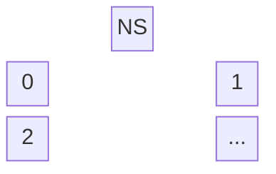
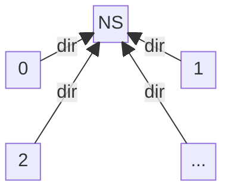
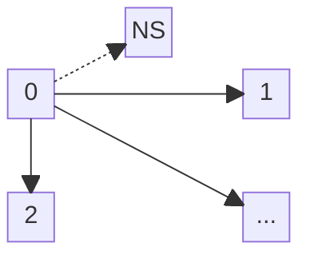
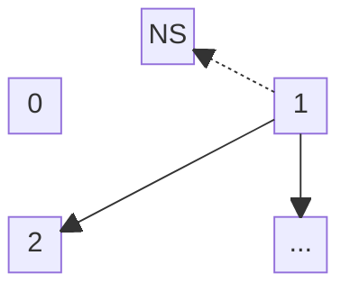
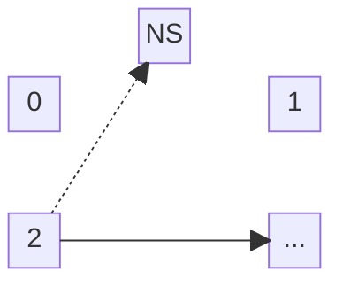
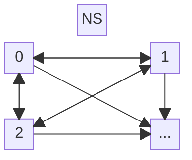
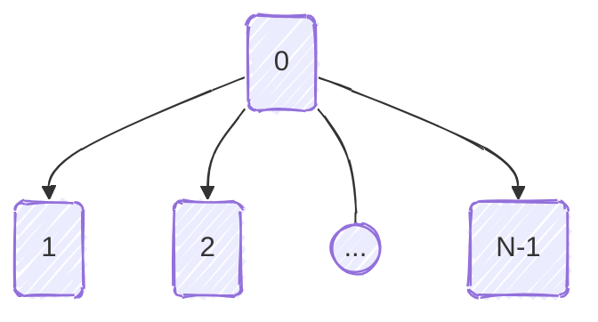
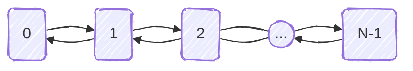

# Example of message passing
+ **Felix García Carballeira and Alejandro Calderón Mateos** @ arcos.inf.uc3m.es
+ [](https://github.com/acaldero/uc3m_ds/blob/main/LICENSE)


## Contents

* [Statement](#statement)
* [Extended communication system design](#extended-communication-system-design)


## Statement

Consider a system that has an API for associating connection addresses with a unique identifier using the following primitives:
* int **get_address** ( void );
  This service allows a process to obtain its address, which is guaranteed to be unique throughout the system and which it receives when it starts execution.
* int **publish_address** ( int address, int n );
  This service allows a value associated with an address to be published in a name service.
* int **search_address** ( int n ); 
  This service returns the address associated with the name service with the value n.

This system also has the following API for communications:
* int **connect** ( int address ); 
  This service establishes a connection with the process running at the address passed as an argument.
  The call returns a communication descriptor that can be used in sending and receiving operations.
* int **accept** ( int address );
  This service blocks the process that executes it until the process running at the address passed as an argument makes a *connect*.
  The call returns a communication descriptor that can be used in sending and receiving operations.
* int **send_mess** ( int fd, char *p, int len );
  This operation sends a message through the channel with descriptor fd. The sending is non-blocking.
* int **recv_mess** ( int fd, char *p, int len );
  This operation receives a message through the channel with descriptor fd. The reception is blocking.

In this system, you want to design a library that allows you to build a distributed program consisting of N processes.
Each of these processes will have an associated process identifier, an integer between 0 and N-1.
When each process begins execution, it receives this identifier, which can be consulted in the PID variable.
You can also find out the total number of processes (N) by consulting the NP variable.
It is ensured that no two processes have the same identifier. 

The processes have access to the library with the following services to be designed:
* int **init** ( void )
  This service must be executed by all processes at the beginning of their execution. This operation is essential for using the other services.
* int **send** ( int n, char *buf, int len );
  This service sends a message (buf) of length len to the process with identifier n (between 0 and N-1).
  The sending is non-blocking.
* int **recv** ( int n, char *buf, int len );
  This service receives a message of length len in buf from process n. Reception is blocking.
* int **broadcast** ( int root, char *buf, int len );
  With this service, the process with identifier root sends the message buf of length len to all processes in the distributed program except the one executing the call. All processes must execute the call.
* int **barrier** ( void );
  This call blocks a process until all processes in the distributed program have executed it, i.e., all processes must execute it in order to continue their execution.

For the design of the library, the communications API and the API for associating addresses with unique identifiers are available.
Consider that in this system, each process has an associated address that is unique throughout the system and is
specified by an integer. This address is associated with the process at the moment it begins
execution. 


## Design of the expanded communication system

### int **init** ( void ) 

All processes must call this function before the rest of the functions.
After its execution, we will have in the vector *vc[j]* the connection descriptor associated for process i to connect to process j, so that all processes are connected.

Initially, there are N processes identified from 0 to N-1 and an address service:


Each process obtains its address and publishes it in the address service:


Process 0 connects to all others (except itself) that have a higher identifier, asking the address service for the associated address for each one:


Process 1 connects to all others (except itself) that have a higher identifier (asking the address service for the associated address for each one) and accepts connections from those that have a lower identifier than itself:


And so on, saving the associated connection descriptor in the vector *vc[j]* so that process i connects to process j:


In the end, all processes are connected to all others:


The design expressed in C code would be:

```c
int init ( void )
{
   int dir, dir2;

   dir = get_address();
   publish_address(dir, PID);

   for (int i=0; i<N; i++)
   {
       if (i == PID) {
           continue ; // skip the process itself
       }

       dir2 = search_address(i);
       if (i > PID)
            vc[i] = connect(dir2);
       else vc[i] = accept(dir2) ;
   }
}
```


### int **send** ( int n, char *buf, int len )

The process that calls this function sends a message *buf* of *len* bytes to the process with identifier *n*, without blocking until it reaches its destination. 

The design of this functionality involves translating the unique process descriptor to the associated address through the translation vector *vc* and calling the existing send function. Therefore, the design would be:

```c
int send ( int n, char *buf, int len )
{
   return send_mess(vc[n] , buf, len) ;
}
```


### int **recv** ( int n, char *buf, int len ) 

The process that calls this function is blocked until it receives a message in *buf* of *len* bytes from process *n*.

The design of this functionality also involves translating from the unique process descriptor to the associated address through the translation vector *vc* and calling the existing receive function. Therefore, the design would be:

```c
int recv ( int n, char *buf, int len )
{
   return recv_mess(vc[n] , buf, len) ;
}
```


### int **broadcast** ( int root, char *buf, int len )

All processes must call this function so that the process with identifier *root* sends the message *buf* of *len* bytes to all other processes in the distributed program. And processes whose identifier is not *root* are responsible for receiving the message *buf* of *len* bytes sent by the *root* process.
 

There are several ways to design this functionality.
The simplest is shown in the following figure:



One way to express the above design in C would be as follows:

```c
int broadcast ( int root, char *buf, int len )
{
    if (root != PID) {
        return recv(root, buf, len) ;
    }

    // root == PID 
    for (int i=0; i<N; i++)
    {
        if (i != PID) {
            ret = send(i, buf, len) ;
        }
    }

    return ret ;
}
```


### int **barrier** ( void )

Calling this function causes the process to block until all processes in the distributed program have called this function. Once all have called this function, all processes can continue their execution.

Although there are several ways to design this functionality, we are going to create a design based on connecting all the processes in a circle so that process 0 sends a 1-byte token to process 1, which sends it to process 2, and so on until process N-1. When the token reaches process N-1, it means that all processes have called the barrier function, and all processes can now be unlocked. To do this, a token is sent back to N-2, and so on until it reaches process 0 again, ending the execution of *barrier* after sending this second token, as shown in the following figure:



One way to express the above design in C would be as follows:

```c
int barrier ( void )
{
    char token = 'x' ;

    if (PID == 0) {
        send(1, &token, 1);
        recv(1, &token, 1);
    }
    if (PID == N-1) {
        recv(N-2, &token, 1);
        send(N-2, &token, 1);
    }
    if (PID != 0) && (PID != N-1)
    {
        recv(PID-1, &token, 1);
        send(PID+1, &token, 1);
        recv(PID+1, &token, 1);
        send(PID-1, &token, 1);
    }
}
```
