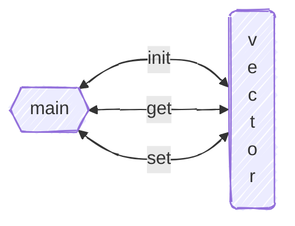
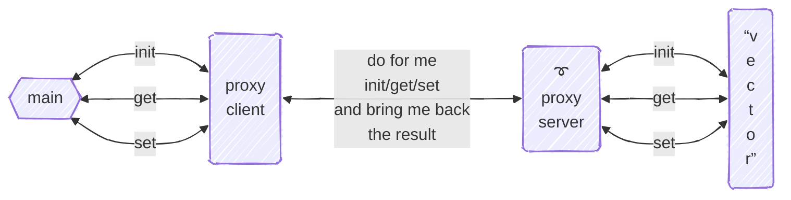

# Example of message passing
+ **Felix García Carballeira and Alejandro Calderón Mateos** @ arcos.inf.uc3m.es
+ [](https://github.com/acaldero/uc3m_sd/blob/main/LICENSE)


## Contents

 * [Statement](#statement)
 * [Progressive design from monolithic to distributed application](#progressive-design-from-monolithic-to-distributed-application)
 * [Design of the initial monolithic version](#design-of-the-initial-monolithic-version)
 * [Transition from monolithic to general distributed](#transition-from-monolithic-to-general-distributed)
 * [General distributed to distributed with POSIX message queues](#general-distributed-to-distributed-with-posix-message-queues)
 * [Concurrent execution on the server](#concurrent-execution-on-the-server)


## Statement

We want to design a distributed vector model.
The following services are defined on a distributed vector:
* int **init** ( char *name, int N )
  This service allows you to initialize a distributed array of N integers.
  The function returns 1 when the array has been created for the first time. If the array has already been created, the function returns 0. The function returns -1 in case of error.
* int **set** ( char *name, int i, int value )
  This service inserts the value at position i of the name array.
* int **get** ( char*name, int i, int *value )
  This service allows you to retrieve the value of element i of the name array.

Design a **distributed system** that implements the service with **POSIX queues** so that it allows you to work with multiple clients **concurrently**.


## Progressive design from monolithic to distributed application

It is important to use a progressive design, one that starts with basic functionality and to which aspects of a distributed system can be added little by little, with POSIX message queues and concurrency.

Therefore, the steps to follow are:
1. Design a monolithic system with the requested functionality.
2. Modify the previous design to change from a monolithic system to a distributed system using the *proxy* pattern.
3. Modify the previous design so that the distributed system uses POSIX message queues as communication primitives.
4. Modify the previous design so that the servers are concurrent.


## Design of the initial monolithic version

The first design to be made is neither distributed nor concurrent.
We will start by designing a **vector** library that implements the API indicated in the statement and the **main** application that uses the library:



This will allow us to test that the implementation of these system components works more easily.

For this design, we will take the following steps:

1. Example of the main test program in ```main.c```:
   ```c
   #include <stdio.h>
   #include <stdlib.h>
   #include "lib.h"
   
   char *A = "name" ;
   int   V = 0x123 ;
   int main ( int argc, char *argv[] )
   {
       int ret, val ;

       ret = init(A, 10) ;
       if (ret < 0) { printf("init: error code %d\n", ret); exit(-1); }

       ret = set (A, 1, V) ;
       if (ret < 0) { printf("set: error code %d\n", ret); exit(-1); }
      
       ret = get(A, 1, &val);
       if (ret < 0) { printf(2get: error code %d\n", ret); exit(-1); }

       if (V != val) { printf("set %d but get %d\n", V, val); exit(-1); }
      
       printf("OK\n");
       return 0;
   }
   ```

2. Data structures to be used in ```lib.c```:
   ```c
   #include "lib.h"

   int    a_neltos= 0 ;
   int  * a_values[100] ; // = [ [0…N1], [0…N2], ... [0…NN] ] ;
   
   char * a_keys[100];   // = [ "key1", "key2", ... "keyN" ];
   ```

3. Auxiliary functions of<br>
   (a) search for a name in the *a_keys* array of keys and <br>
   (b) insert a new array with *name* and *N* elements of type integer:
   ```c
   int search ( char *name )
   {
      int index= -1 ;
           
      for ( int i=0; i<a_neltos; i++ ) {
           if (!strcmp(a_keys[i], name)) {
               return i;
           }
      }
      return index;
   }
   
   int insert(char *name, int N)
   {
       a_values[a_neltos] = malloc(N*sizeof(int));
       if (NULL == a_values[a_neltos]) {
           return -1; // in case of error => -1
       }
       
       a_keys[a_neltos] = strdup(name);
       if (NULL == a_keys[a_neltos]) {
           free(a_values[a_neltos]);
           return -1; // in case of error => -1
       }
       a_neltos++;
       return 1; // all good => return 1
   }
   ```

4. Requested functions (based on what has been developed previously):
   ```c
   // Initialize a distributed array of N integers.
   int init ( char *name, int N )
   {
      int index = search(name) ;
      if (index != -1) return 0 ; // If array is already created => return 0
   
      index = insert(name, N);
      if (index == -1) return -1; // in case of error => -1
   
      return 1; // the array has been created for the first time => return 1
   }
   
   // Insert the value in position i of the name array. 
   int set ( char *name, int i, int value )
   {
       int index = search(name) ;
       if (index == -1) return -1 ; // If error => return -1
   
       a_values[index][i] = value ;
       return 1; 
   }
   
   // Retrieve the value of element i of the name array.
   int get(char*name, int i, int *value)
   {
      int index = search(name);
      if (index == -1) return -1; // If error => return -1
   
      *value = a_values[index][i];
      return 1; 
   }
   ```

5. Interface of the requested functions (based on what was developed previously) in ```lib.h```:
   ```c
   #include <stdlib.h>
   #include <string.h>
   
   // Initialize a distributed array of N integers.
   int init ( char *name, int N ) ;

   // Insert the value at position i of the name array.
   int set ( char *name, int i, int value ) ;
   
   // Retrieve the value of element i of the name array.
   int get ( char*name, int i, int *value ) ;
   ```

To compile and execute:
```bash
gcc -g -Wall -o lib.o  -c lib.c
gcc -g -Wall -o main.o -c main.c
gcc -o main main.o lib.o
./main
```


## Transition from monolithic to general distributed

To transform the initial monolithic design into a distributed application design, we will use the design pattern called **proxy**.
The following figure shows its application:



As you can see, instead of interacting directly with vector, the **main** application will interact with a new component called *proxy* on the client side that has the same interface as **vector**.
**main** is made to believe that it is interacting with **vector**, but instead it is interacting with the client side of the *proxy*. <br>
This client *proxy* is responsible for sending a remote request to another new component called *proxy* on the server side, which it asks to make the **main** request on its behalf and return the result.
The proxy on the server side has access to the original vector library from the monolithic design and is responsible for receiving requests from the proxy on the client side and making the invocation on its behalf, to send back the result of that invocation.

In this way, it is possible to transform part of a monolithic application into a distributed part, facilitating testing since the **main** and **vector** components are the same as those in the monolithic application, which have already been tested.

For this design, we will take the following steps:

1. Client-side proxy:
   ```c
   int send_recv ( message *msg )
   {
       c1 = "colamsg_connect" /SERVER
       "colamsg_send"       c1 msg
       "colamsg_receive"    c1 msg
       "colamsg_disconnect" c1
       return msg
   }
   
   int init ( char *name, int N )
   {
       request  = (init, name, N)
       response = send_recv(request)
       return response.status
   }

   int set(char *name, int i, int value)
   {
       request  = (set, name, i, value)
       response = send_recv(request)
       return response.status
   }
   
   int get(char*name, int i, int *value)
   {
       request  = (get, name, i)
       response = send_recv(request)
      *value = response.value
      
       return response.status
   }
   ```

2. *Proxy* on the server side:
   ```c
   int main( int argc, char *argv)
   {
      c1 = "colamsg_create" /SERVER
   
      while(TRUE)
      {
         "colamsg_receive" c1 request
         switch( request.operation)
         {
            case INIT: response.status= _init(request.name, request.N) ;
                       break;
            case GET:  response.status= _get(request.name, request.i, &response.value) ;
                       break;
            case SET:  response.status= _set(request.name, request.i, request.value) ;
                       break;
         }
   
         "colamsg_send" c1 response
      }
   }
   ```


## General distributed to distributed with POSIX message queues

POSIX message queues allow two processes to be interconnected in a distributed manner, but they have some peculiarities that require adapting the previous design, which is for a generic distributed system. <br>
The main *peculiarities* that initially affect the design are:
* They are unidirectional
* To simplify their use, it is necessary to design a single message that is valid for all operations
* They use the file system of the machine where the processes are executed (which makes it less distributed but serves as a starting point)

The following steps can be used for this design:
1. The main data types to be used are a structure for requests (which will be a fusion of all the fields necessary in all operations) and another for responses (which will also be a fusion of all responses):
   
   ```c
   // request = op + q_name + (name, N) + (name, i, value) + (name, i)
   struct request
   {
      int   op;
      char  name[MAX] ;
      int   value;
      int   i;
      char  q_name[MAX];
   } ;
   
   // response = (value, status)
   struct response
   {
      int  value;
      char status;
   } ;
   ```

1. *Proxy* on the client side (in which the request sends the name of the queue that the client will use for the response):
   ```c
   // *get* function as an example, the rest would be similar
   int get ( char *name, int i, int *value )
   {
      struct request  p;
      struct response r;
      unsigned int prio = 0;  // POSIX queues
   
      // prepare message
      p.op = 2;  // the value 2 identifies "get" in the example
      p.i  = i;  // the value i is the key
      strcpy(p.name, name); // name of the vector
      sprintf(p.q_name, "%s%d", "/CLIENT_", getpid()) ;
   
        // Initialize POSIX queues
        int qs = mq_open("/SERVER", O_WRONLY, 0700, NULL) ;
        if (qs == -1) { return-1 ; }
        int qr = mq_open(p.q_name, O_CREAT|O_RDONLY, 0700, NULL) ;
        if (qr == -1) { mq_close(qs); return-1; }
      
        // sending request and receiving response with POSIX queues
        mq_send   (qs, (char *)&(p), sizeof(structrequest),  0) ;
        mq_receive(qr, (char *)&(r), sizeof(structresponse), &prio) ;
   
        // closing POSIX queues
        mq_close(qs); mq_close(qr);
        mq_unlink(qr_name);
   
      *value = r.value;
      return (int)(r.status);
   }
   ```

1. *Proxy* on the server side:
   ```c
   int end_execute = 0;

   void handle_request ( struct request * p );

   int main( int argc, char *argv[] )
   {
      struct request p;
      unsigned int prio;
            
      int qs = mq_open("/SERVER", O_CREAT | O_RDONLY, 0700, NULL);
      if (qs == -1) { return-1; }
      while (fin_execute != 1)
      {
          mq_receive(qs, &p, sizeof(p), &prio); 
          handle_request(&p);
      }
   }

   void handle_request(struct request *p)
   {
      struct response r;
   
      // handle request...
      switch (p->op)
      {
         case 0: // INIT
              r.status = real_init (p->name, p->value);
              break;
         case 2: // GET
              r.status= real_get(p->name, p->i, &(r.value));
              break;
         case 3: // SET
              r.status= real_set(p->name, p->i, p->value));
              break;
      }
      
      // send response back to client
      int qr = mq_open(p->q_name, O_WRONLY, 0700, NULL) ;
      mq_send(qr, &r, sizeof(structresponse), 0) ; // prio== 0
      mq_close(qr);
   }
   ```


## Concurrent execution on the server

Adding concurrency to the proxy on the server side means that for each request that arrives, a thread must be created to handle it:
   
   ```c
   int main ( int argc, char *argv[] )
   {
        struct request p;
        unsigned int prio; // and some more variables...

        ///// Initialize attributes for threads to be created
        pthread_attr_init(&attr) ;
        pthread_attr_setdetachstate(&attr, PTHREAD_CREATE_DETACHED) ;  

        // create server queue to read requests
        int qs= mq_open("/SERVER", O_CREAT | O_RDONLY, 0700, NULL) ;
        if (qs == -1) { return-1 ; }

        while(1)
        {
            mq_receive(qs, &p, sizeof(struct request), &prio) ;

            ///// Instead of executing “treat_request(&p);” here, a thread is created for this purpose
            pthread_create(&thid, &attr, process_request, (void*)&p);

            ///// Important: pause main until two tasks in process_request are completed: thread created and parameter "&p" copied
            <code to wait until the thread has been created and &p copied>
        }
   }
   ```

The **treat_request** function is modified to be the thread code:

   ```c
   pthread_mutex_t mutex_2 = PTHREAD_MUTEX_INITIALIZER; ///// API mutex

   void treat_request ( struct request * p )
   {
      struct response r ;
            
      // Important: copy parameter "*p" and wake up the main thread
      <synchronization code for "p_local= *p" and signal that it has been copied>

      pthread_mutex_lock(&mutex_2); ///// API lock
      switch (p->op)
      {
         case 0: // INIT
              r.status= real_init(p->name, p->value);
              break;
         case 2: // GET
              r.status= real_get(p->name, p->i, &(r.value));
              break;
         case 3: // SET
              r.status= real_set(p->name, p->i, p->value);
              break; 
      }
      pthread_mutex_unlock(&mutex_2); ///// API unlock

      int qr= mq_open(p->q_name, O_WRONLY, 0700, NULL);
      mq_send(qr, &r, sizeof(structresponse), 0); // prio== 0
      mq_close(qr);

      pthread_exit(NULL);
   }
   ```

The following table details these points:

| <code to wait for the thread to be created and copied &p>           | Synchronization code for <br>"p_local= *p" and signal that copied   |
|---------------------------------------------------------------------|---------------------------------------------------------------------|
| pthread_mutex_lock(&sync_mutex);                                    |                                                                     |
| while (sync_copied == FALSE) {                                      | pthread_mutex_lock(&sync_mutex);                                    |
| &nbsp;&nbsp;&nbsp;&nbsp;pthread_cond_wait(&sync_cond, &sync_mutex); | p_local = *p;                                                       |
| }                                                                   | sync_copied = TRUE;                                                 |
| sync_copied = FALSE;                                                | pthread_cond_signal(&sync_cond);                                    |
| pthread_mutex_unlock(&sync_mutex);                                  | pthread_mutex_unlock(&sync_mutex);                                  |

<br>

With these changes, the **main** function will be:

   ```c
   int main ( int argc, char *argv[] )
   {
        struct request p;
        unsigned int prio; // and some more variables...

        pthread_attr_init(&attr) ;
        pthread_attr_setdetachstate(&attr, PTHREAD_CREATE_DETACHED) ;  
        int qs= mq_open("/SERVER", O_CREAT | O_RDONLY, 0700, NULL) ;
        if (qs == -1) { return-1 ; }

        while (1)
        {
             mq_receive(qs, &p, sizeof(struct request), &prio);

             // Instead of executing "process_request(&p);" here, a thread is created for this purpose
             pthread_create(&thid, &attr, process_request, (void*)&p);

             ///// <code to wait until the thread has been created and &p copied>
             pthread_mutex_lock(&sync_mutex);
             while (sync_copied == FALSE) {
                    pthread_cond_wait(&sync_cond, &sync_mutex) ;
             }
             sync_copied= FALSE ;
             pthread_mutex_unlock(&sync_mutex) ;
             ///// </end wait code>
        }
   }
   ```

The **treat_request** function is modified to be the thread code:

   ```c
   pthread_mutex_t mutex_2 = PTHREAD_MUTEX_INITIALIZER; ///// mutex API
   
   void handle_request ( struct request * p )
   {
      struct response r ;

           ///// <synchronization code for "p_local= *p" and signal that copied>
           pthread_mutex_lock(&sync_mutex) ;
           p_local= *p ;
           sync_copied = TRUE;
           pthread_cond_signal(&sync_cond);
           pthread_mutex_unlock(&sync_mutex);    
           ///// </end synchronization code>

      pthread_mutex_lock(&mutex_2); ///// API lock
      switch (p->op)
      {
         case 0: // INIT
              r.status= real_init(p->name, p->value);
              break;
         case 2: // GET
              r.status= real_get(p->name, p->i, &(r.value) ;
              break ;
         case 3: // SET
              r.status= real_set(p->name, p->i, p->value) ;
              break; 
      }
      pthread_mutex_unlock(&mutex_2); ///// API unlock

      int qr= mq_open(p->q_name, O_WRONLY, 0700, NULL);
      mq_send(qr, &r, sizeof(structresponse), 0); // prio== 0
      mq_close(qr);

      pthread_exit(NULL);
   }
   ```

