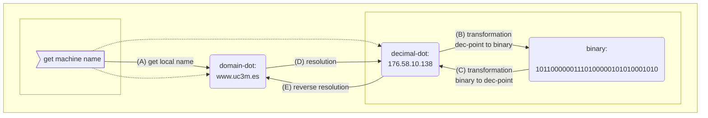
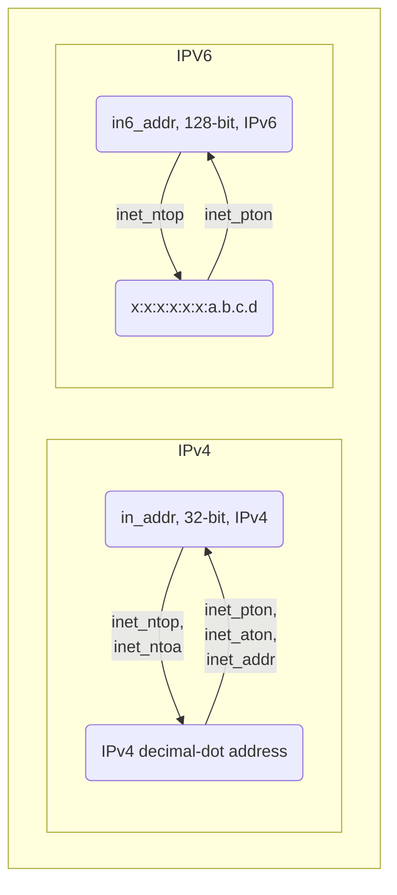
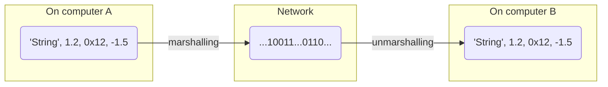
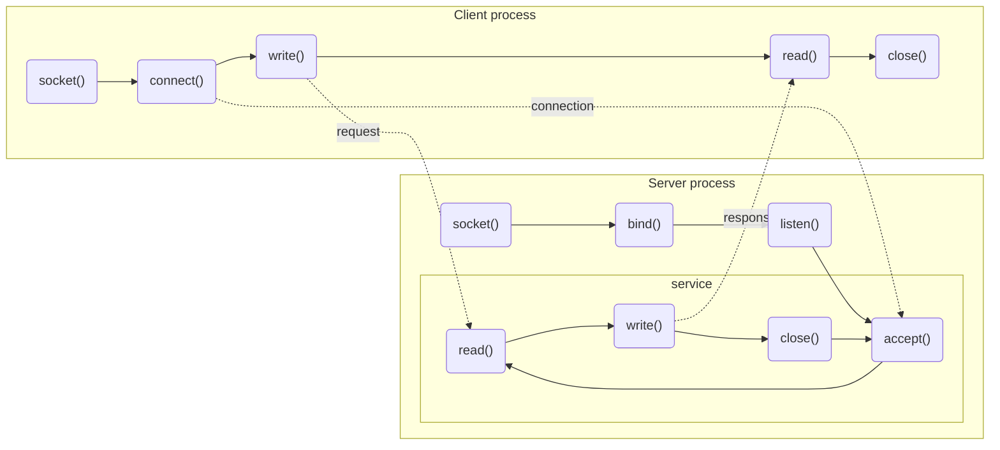
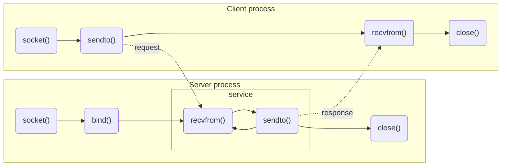

# Communication with Sockets
+ **Felix García Carballeira and Alejandro Calderón Mateos** @ arcos.inf.uc3m.es
+ [](https://github.com/acaldero/uc3m_sd/blob/main/LICENSE)


## Contents

* Introduction to sockets
  * [Motivation](#introduction-to-sockets)
  * [Domains and types](#sockets-communication-domains)
  * [Addresses and ports](#addresses)
     * [Examples in C and Python](#conversion-examples)
  * [Data representation](#byte-order-big-endian-and-little-endian)
* Communication models
  * [Stream or connection-oriented](#communication-models-connection-oriented)
     * [Example in C](#example-of-connection-oriented-socket-usage-in-c)
     * [Example in Python](#example-of-using-connection-oriented-sockets-in-python)
  * [Datagram or connectionless](#connectionless-communication-models-connection-in-c)
     * [Example in C](#communication-models-connectionless-in-c)
     * [Example in Python](#example-of-using-connection-oriented-sockets-in-python)
* Additional aspects
   * [Most common socket options](#important-options-associated-with-a-socket)
   * [Sequential server vs heavy processes vs threads](#sequential-server-vs-heavy-processes-vs-threads)
   * [Working with heterogeneity in distributed systems](#working-with-heterogeneity-in-distributed-systems)


## Introduction to sockets

* IPC mechanism for communicating between processes running on different machines
  * Other possible IPC mechanisms: files, named pipes, etc.

* Brief history:
  * The first implementation appeared in 1983 in UNIX BSD 4.2
    * Attempt to include TCP/IP in UNIX
    * Design independent of the communication protocol
  * API formally specified in the POSIX.1g standard (2000)
  * Currently:
    * Available on virtually all operating systems: Linux, Windows, MacOS, etc.
    * API in almost all languages: Java (as a native class), Python (as a socket package), etc.


## What a socket represents

```c
#include <sys/socket.h>

int socket(int domain, int type, int protocol) ;
...
```

* A **socket** is an abstraction that:
  * Represents one end of a bidirectional communication with an associated triplet (protocol, address, port)
  * Provides an interface for accessing the TCP/IP transport layer

* A **socket** is represented as a descriptor of a communication endpoint (**IP address** and **port**)

* Three elements associated with a socket upon creation:
  * Communication domain
  * Socket type
  * Protocol


## Sockets: communication domains

```c
int socket(int domain, int type, int protocol);
//             ^^
```

* **Communication domain**
  * A socket is associated with a domain from the moment it is created
  * Only sockets from the same domain can communicate
  * Socket services are independent of the domain
  * Examples:
    * AF_UNIX: communication within a machine
    * AF_INET: communication using TCP/IP protocols (IPv4)
    * AF_INET6: communication using TCP/IP protocols (IPv6)
  * Socket types
  * Protocol


## Sockets: socket type

```c
int socket(int domain, int type, int protocol) ;
//                         ^^
```

* Communication domain
    * AF_INET: communication using TCP/IP protocols (IPv4)
    * AF_INET6: communication using TCP/IP protocols (IPv6)

* **Socket type**
   * SOCK_STREAM: Stream, TCP protocol
   * SOCK_DGRAM: Datagram, UDP protocol
   * SOCK_RAW: Raw, no transport protocol (IP protocol)
  
* Protocol


## Sockets: protocol

```c
int socket(int domain, int type, int protocol) ;
//                                   ^^
```

* Communication domain
   * AF_INET: communication using TCP/IP protocols (IPv4)
   * AF_INET6: communication using TCP/IP protocols (IPv6)

* Socket type
   * SOCK_STREAM: Stream
   * SOCK_DGRAM: Datagram
   * SOCK_RAW: Raw

* **Protocol**
   * 0: default value (see /etc/protocols for others)


## **Stream** vs **datagram** socket


| socket         | stream         | datagram       |
|----------------|----------------|----------------|
| Protocol       | TCP            | UDP            |
| Data flow      | bidirectional  | bidirectional  |
| Connection     | end-to-end connection before data exchange | No connection between communicating processes |
| Packetization  | byte stream<br> (does not preserve the boundary between messages) | datagram flow (a datagram is a self-contained entity, maintains separation between packets) (1) |
| Reliability    | Yes (2)          | No<br>(disordered, duplicates, losses) |
| Examples       | HTTP, FTP, etc.  | DNS  |
 
* (1) Maximum length of a datagram (data and headers) is 64 KB<br>IP header + UDP header = 28 bytes
* (2) Packets sorted by sequence, no packet duplication, error-free, error notification


## Comparison of TCP, UDP, and IP protocols

| Feature                    | IP  | UDP  | TCP |
|----------------------------|-----|------|-----|
| Connection-oriented        | NO  | NO   | YES |
| Limit between messages     | YES | YES  | NO  |
| Ack                        | NO  | NO   | YES |
| Timeout and retransmission | NO  | NO   | YES |
| Duplication detection      | NO  | NO   | YES |
| Sequencing                 | NO  | NO   | YES |
| Flow control               | NO  | NO   | YES |


## Information associated with a communication

The information associated with a communication must include:
```
  (Protocol, Local IP, Local P, Remote IP, Remote P)
```

Where:
* Protocol: TCP, UDP, RAW
* Local IP:  local IP address (source)
* Local P:   local port (source)
* Remote IP: remote IP address (destination)
* Remote P:  remote port (destination


## Addresses

* Addresses are used to:
  * Assign a local address to a socket (bind)
  * Specify a remote address (connect or sendto)
 
* Addresses are domain-dependent
  * Each domain uses a specific structure
    * Addresses in AF_UNIX (``struct sockaddr_un``)
      * File name
    * Addresses in AF_INET (``struct sockaddr_in``)
      * Host address (32 bits) + port (16 bits) + protocol
  * The generic structure ``struct sockaddr`` is used in the API
  * Type conversion (casting) is necessary in calls


## Ports

* A port is associated with a destination process on a computer:
   * Allows transmission to be directed to a specific process on the destination computer
   * A port has a single receiver and multiple senders (except multicast)
   * Any application that wants to send and receive data must "open" a port

* It is represented by a 16-bit unsigned integer:
   * 2<sup>16</sup> ports on a machine ~ 65536 possible ports
   * Reserved by IANA for Internet applications:
      * 0-1023 (also called *well-known* ports)
      * Ports between 1024 and 49151 are registered ports to be used by services
      * Ports above 65535 are for private use
      * http://www.iana.org/assignments/port-numbers

* The port space for streams and datagrams is independent


## Host IP address

* In C, a host IP address is stored in a structure of type ```in_addr```:
   ```c
   # include <netinet/in.h>

   typedef uint32_t in_addr_t;

   struct in_addr {
      in_addr_t s_addr; /* 32-bit unsigned integer */
   };

   ...
   struct in_addr a1 ;
   a1.s_addr = inet_addr("10.12.110 .57"); // a.s_addr is the address in binary
   ...
   ```

* <details>
  <summary>In Python...</summary>
  The ipaddress module includes classes for working with IPv4 and IPv6 network addresses

  ### ip_address.py
  ```python
  import binascii
  import ipaddress

  addr = ipaddress.ip_address('176. 58.10.138')
  print(addr)

  print(' IP version:',  addr.version)
  print(' is private:',  addr.is_private)
  print(' packed form:', binascii.hexlify(addr.packed))
  print(' integer:',     int(addr))
  print('')
  ```
  </details>


## Addresses in AF_INET

* In C, an address includes the IP address, port, and family in the ```struct sockaddr_in``` structure:
  ```c
  #include <netinet/in.h>

  struct sockaddr_in
  {
    short          sin_family;  /* Internet domain (AF_INET) */
    in_port_t      sin_port;    /* port: 16-bit unsigned integer */
    struct in_addr sin_addr;    /* IP address (32-bit unsigned integer) */
    unsigned char  sin_zero[8]; /* padding (8 bytes) */
  };

  ...
  struct sockaddr_in a2;
  memset(&a2, 0, sizeof(struct sockaddr_in)); // initialize everything to zero
  a2.sin_family      = AF_INET ;
  a2.sin_port        = htons(8080) ;
  a2.sin_addr. s_addr = inet_addr("10.12.110.57");
  ```
* **TIP:** When using ```struct sockaddr_in``` , all fields must be initialized to 0 to clear any previous values.


## Services on addresses (1/2)

 * There are different notations for an address:
    | Notation      | Example                           | Format  | Understandable by |
    |---------------|-----------------------------------|---------|-------------------|
    | domain-dot    | "www.uc3m.es"                     | Text    | Human             |
    | decimal-dot   | "176.58.10.138"                   | Text    | Human             |
    | binary        | 10110000001110100000101010001010  | Binary  | Machine           |


* Address services:
   * Get the name of the local machine (e.g., "node1.inf.uc3m.es")
   * Get the address of a host (e.g., "node1.inf.uc3m.es" -> "10.1.2.3")
   * Transform addresses (e.g.: "10.1.2.3" -> 0x12345678 / 0x12345678 -> "10.1.2.3")


## Address services (2/2)




## Services on addresses: (A) obtain the local name

* In C, ```gethostname``` is the function that provides the name of the machine (domain dot format) on which it is running:
  ```c
  int gethostname ( char *name,        // buffer where the name is stored
                    size_t namelen );  // buffer length
  ```

#### gethostname.c
```c
#include <unistd.h>
#include <stdio.h>
#include <stdlib.h>

int main ()
{
    char machine[256];
    int ret;

    ret = gethostname(machine, 256);
    if (ret < 0) {
        perror("gethostname: ") ;
        return -1;
    }
    
    printf("Running on machine %s\n", machine) ;
    return 0 ;
}
```

* <details>
  <summary>In Python...</summary>
  The gethostname method of the socket class takes care of this.

  ### gethostname.py
  ```python
  import socket
  name = socket. gethostname();
  print('host name: ' + name)
  ```
  </details>


## Services on addresses: (B) decimal-dot -> binary

```c
struct sockaddr_in  a4;
struct sockaddr_in6 a6;
memset(&a4, 0, sizeof(struct sockaddr_in));  // initialize everything to zero
memset(&a6, 0, sizeof(struct sockaddr_in6)); // initialize everything to zero
 ```

  * **inet_addr** -> PROBLEM: the returned error is confused with a valid value
    ```c
    // (option 1) in_addr_t inet_addr(const char *cp);
    a4.sin_addr.s_addr = inet_addr("10.10.10.57");
    if (INADDR_NONE == a4.sin_addr.s_addr) {
        // INADDR_NONE: address with all bits set to one
        printf("ERROR in inet_addr\n");
    }
    ```
  * **inet_aton** ->  PROBLEM: inet_aton is only valid for IPv4
    ```c
    // (option 2) int inet_aton(char *str, struct in_addr *addr);
    int ret = inet_aton("10.10.10.57", &(a4.sin_addr.s_addr));
    if (0 == ret) {
        printf("ERROR in inet_aton\n");
    }
    ```
* **inet_pton** -> valid for IPv4 and IPv6
   ```c
    // (option 3) int inet_pton(int family, const char *strptr, void * addrptr);
    int ret = inet_pton(AF_INET6, "2024:db8:8722:3a92::15", &(a6.sin6_addr));
    if (ret != 1) {
        printf("ERROR in inet_pton\n") ;
    }
   ```


## Services on addresses: (C ) binary -> decimal-dot

```c
struct sockaddr_in  a4;
memset(&a4, 0, sizeof(struct sockaddr_in));  // initialize everything to zero
```

  * **inet_ntoa** ->  PROBLEM: inet_ntoa is only valid for IPv4
    ```c
    // (option 1) int inet_ntoa(...
    char str4[INET_ADDRSTRLEN];
    char *ret = inet_ntoa(a4.sin_addr.s_addr);
    if (NULL == ret) {
        printf("ERROR in inet_ntoa\n") ;
    }
    ```
* **inet_ntop** -> valid for IPv4 and IPv6
   ```c
   // (option 2) const char *inet_ntop(int domain, const void *addrptr, char *dst_str, size_t len);
   char str4[INET_ADDRSTRLEN];
   ptr = inet_ntop(AF_INET, &(a4.sin_addr.s_addr), str4, sizeof(str4));
   if (NULL == ret) {
       printf("ERROR in inet_ntop\n"); 
   }
   ```


## Obtaining information about a machine: (D, B, and E) resolving names (classic form)

* Information about a machine is represented by the ``struct hostent`` structure:
  ```c
  struct hostent
  {
       char   *h_name;
       char  **h_aliases ;
       int     h_addrtype ;
       int     h_length ;
       char  **h_addr_list ;
  }
  ```

  * Obtains information about a host from an address in domain-dot format
    ```c
    struct hostent *gethostbyname ( char *str );  // str: machine name
    ```
    
  * Obtains information about a host from an IP address
    ```c
    struct hostent *gethostbyaddr ( const void *addr,  // addr: pointer to struct in_addr
                                    int len,           // len:  size of the structure
                                    int type);         // type: AF_INET
    ```
    
  * An example of a filled  ``struct hostent`` structure could be:

    <html>
    <p align="center">
      <br>
    <small><b>Image from  http://www.cs.emory.edu/~cheung/Courses/455/Syllabus/9-netw-prog/netw-supp4.html</b></small>
    </p>
    </html>


## Obtaining information about a machine: (D, B, and E) Resolving names (modern form)

* For both IPv4 and IPv6, it is recommended to use the new  ``struct addrinfo`` structure:
  ```c
    struct addrinfo {
       int    ai_flags;    // AI_PASSIVE, AI_CANONNAME, AI_NUMERICHOST, etc.
       int    ai_family;   // PF_UNSPEC, PF_INET, etc.
       int    ai_socktype; // SOCK_STREAM, SOCK_DGRAM
       int    ai_protocol; // IPPROTO_TCP, IPPROTO_UDP
       size_t ai_addrlen;
       char * ai_canonname;
       struct sockaddr * ai_addr;
       struct addrinfo * ai_next;
    };
  ```

  * The equivalent of ``gethostbyname`` for IPv4 and IPv6 is **getaddrinfo** + **freeaddrinfo**
    ```c
      int getaddrinfo ( const char *restrict node,
                        const char *restrict service,
                        const struct addrinfo *restrict hints,
                        struct addrinfo **restrict res );
      void freeaddrinfo ( struct addrinfo *res );
    ```

    It is advisable to see the example of [Beej's simple server](https://beej.us/guide/bgnet/html/#a-simple-stream-server) on the use of getaddrinfo+freeaddrinfo since its use is not a simple change from gethostbyname to getaddrinfo. Regarding the results that getaddrinfo returns, you have to iterate and try socket+bind or socket+connect until the first result that allows it, which will be the one that works.

  * The **getnameinfo** function is the inverse of getaddrinfo: it converts an internal socket address into the corresponding readable name and service, independently of the protocol.
    ```c
      int getnameinfo ( const struct sockaddr *sa,
                        socklen_t salen,
                        char *host, size_t hostlen,
                        char *serv, size_t servlen, int flags );
    ```


## Conversion examples



* In C:

  * <details>
    <summary>Example of inet_aton + inet_ntoa... </summary>

    ### addresses.c
    ```c
    #include <stdlib.h>
    #include <stdio.h>
    #include <sys/socket.h>
    #include <netinet/in.h>
    #include <arpa/inet.h>

    int main(int argc, char **argv)
    {
       struct in_addr in;
       
       if (argc != 2) {
           printf("Usage: %s <decimal-dot>\n", argv[0]);
           exit(0);
       }

       if (inet_aton(argv[1], &in) == 0) {
           printf("Address error\n ");
           exit(0);
       }

       printf("The address is %s\n", inet_ntoa (in));
       exit(0);
    }
    ```
    </details>

  * <details>
    <summary>In C, example of gethostbyname + inet_ntoa...</summary>

    ### dns.c
    ```c
    #include <stdio.h>
    #include <string.h>
    #include <stdlib.h>
    #include <netdb.h>
    #include <sys/socket.h>
    #include <netinet/in.h>
    #include <arpa/inet.h>

    int main ( int argc, char **argv )
    {
        struct hostent *hp;
        struct in_addr  in;
        
        hp = gethostbyname("www.uc3m.es");
        if (hp == NULL) {
            printf("Error in gethostbyname\n");
            exit(0);
        }

        memcpy(&(in.s_addr), *(hp->h_addr_list), sizeof(in.s_addr));
        printf("%s is %s (%ld)\n", hp->h_name, inet_ntoa(in), in.s_addr);

        return 0;
    }
    ```
    </details>
  
  * <details>
    <summary>Example of inet_aton + gethostbyaddr (D, B, and classic E)...</summary>

    ### obtener-dominio.c
    ```c
    #include <netdb.h>
    #include <stdio.h>
    #include <string.h>
    #include <sys/socket.h>
    #include <netinet/in.h>
    #include <arpa/inet.h>

    int main(int argc, const char **argv)
    {
       struct in_addr addr; struct hostent *hp;
       char **p; struct in_addr in;
       char **q; int err;
       
       if (argc != 2) {
           printf("USAGE: %s <IP-address>\n", argv[0]);
           return (1);
       }

       err = inet_aton(argv[1], &addr);
       if (err == 0) {
           printf("please use IP address in a.b.c.d format\n");
           return (2);
       }

       hp = gethostbyaddr((char *) &addr, sizeof(addr), AF_INET);
       if (hp == NULL) {
           printf("Error in gethostbyaddr\n");
           return (3); 
       }

       for (p = hp->h_addr_list; *p != 0; p++)
       {
           memcpy(&(in.s_addr), *p, sizeof(in.s_addr));
           printf("%s is \t%s (%ld)\n", inet_ntoa(in), hp->h_name, in.s_addr) ;
           for (q=hp->h_aliases; *q != 0; q++) {
                printf("%s\n", *q);
           }
       }

       return(0);
    }
    ```
   </details>
  
  * <details>
    <summary>Example of getaddrinfo + getnameinfo + freeaddrinfo (D, B, and modern E)...</summary>

    ### get-domain-6.c
    ```c
    #include <stdio.h>
    #include <stdlib.h>
    #include <netdb.h>
    #include <string.h>
    #include <netinet/in.h>
    #include <sys/socket.h>

    int main ( int argc, char*argv [] )
    {
        int ret;
        struct addrinfo *results;
        struct addrinfo *res;
        char hostname[1025] ;

        // domain name -> list of addresses
        ret = getaddrinfo("www.uc3m.es", NULL, NULL, &results);
        if (ret < 0) {
            printf("ERROR in getaddrinfo: %s\n", gai_strerror(ret));
            return -1;
        }
  
        // go through all results and do reverse lookup
        for (res = results; res != NULL; res = res->ai_next)
        {
            strcpy(hostname, "");
            ret = getnameinfo(res->ai_addr,
                              res->ai_addrlen,
                              hostname, 1025,
                               NULL, 0, 0);
            if (ret < 0) {
                printf("ERROR in getnameinfo: %s\n", gai_strerror(ret));
                continue;
            }

            if (*hostname != '\0')
                 printf("hostname: %s\n", hostname);
            else printf("hostname: <empty>\n");
        }

        // free memory from results
        freeaddrinfo(results);

        return 0;
    }
    ```
    </details>

* In Python:

  * <details>
    <summary>Example of gethostname + gethostbyname...</summary>
    
    ### gethostname.py
    ```python
    import socket
    name = socket.gethostname();
    print(name + ': ' + socket.gethostbyname(name))
    ```
    </details>
  
  * <details>
    <summary>Example of gethostbyaddr...</summary>

    ### dns.py
    ```python
    import socket
    import sys

    arguments = len(sys.argv)
    if arguments < 2:
       print('Usage: dns <host>')
       exit()
    try:
       hostname, aliases, addresses = socket.gethostbyaddr(sys.argv[1])
       print(sys.argv[1] + ': ', hostname)
       print(sys.argv[1] + ': ', aliases)
       print(sys.argv[1] + ': ', addresses)
    except socket.error as msg:
       print('ERROR: ', msg)
    ```
    </details>

  * <details>
    <summary>Example of inet_aton...</summary>
  
    ### addr_dot2bin.py
    ```python
     import socket
     import struct

     // Example from: https://pythontic.com/modules/socket/inet_aton
     IPQuad  = "192.168.0.0"
     IP32Bit = socket.inet_aton (IPQuad)
     print(IP32Bit)
    ```
    </details>


## Byte order: big-endian and little-endian
 
* There are two orders of bytes in a word in memory:
  * Big-endian
    * Motorola
  * Little-endian
    * Intel, AMD

* The differences between the two can be seen in the following figure (Aeroid, CC BY-SA 4.0, via Wikimedia Commons):
  <html>
  <table border="1">
  <tr>
    <td>
      
    </td>
  </tr>
  </table>
  </html>


## Byte order and *Network Byte Order*
 
* Big-endian is the standard for byte ordering used in TCP/IP
    * Also called *Network Byte Order*

* On computers that do not use Big-endian, it is necessary to use functions to translate numbers between the format used by TCP/IP (Big-endian) and the format used by the computer itself (Little-endian)
  * Host (Little-Endian) -> Network (Big-Endian):
      ```c
       #include <arpa/inet.h>
      u_long  htonl(u_long hostlong);   // translate 32-bit number from host format to net format
      u_short htons(u_short hostshort) ; // translate 16-bit number from host format to net format
      ```
  * Network (Big-Endian) -> host (Little-Endian):
    ```c
       #include <arpa/inet. h>
       u_long ntohl(u_long netlong);     // translate 32-bit number from net format to host
       u_short ntohs(u_short netshort);  // translate 16-bit number from net format to host
    ```


## Data representation: marshalling/unmarshalling
 * In a distributed system with heterogeneous machines, not only can the byte order be different, but also the word size in the connected nodes (32-bit machines, 64-bit machines, etc.), the representation used (two's complement integers, one's complement integers, etc.), the character set (ASCII, utf-16, etc.), etc.
 
* In general, two procedures are required:
    * A **marshalling** or data packaging procedure: <br>transforms the values of the data structures from one machine's format to a common format for sending over the network (external representation).
    * A procedure for **unmarshalling** or unpacking data: <br>transforms the common format received by the network into the format of the machine to which the values are sent (internal representation).



## Communication models: connection-oriented

* Use of TCP via stream sockets (SOCK_STREAM)

<html>
<table>
<tr><th>Server</th><th>Client</th></tr>
<tr>
<td valign=top>
<ul>
   <li> (1) Create a socket (<b>socket</b>) </li>
   <li> (2) Obtain the address</li>
   <li> (3) Assign addresses (<b>bind</b>)</li>
   <li> (4) Prepare to accept connections (<b>listen</b>)</ li>
   <li> For each client:</li>
   <ul>
   <li> (5) Accept a connection (<b>accept</b>)</li>
   <li> (6) Data transfer (<b>read</b> and <b>write</b>)</li>
   <li> (7) Close connected socket (<b>close</ b>)</li>
   </ul>
   <li> (8) Close service socket (<b>close</b>)</li>
</ul>
</td>
<td valign=top>
<ul>
   <li> (1) Create a socket (<b>socket</b>)</li>
   <li> (2) Obtain the address</li>
   <li></li>
   <li></li>
   <li></li>
   <li> (3) Connection request (<b>connect</b>)</li>
   <li> (4) Data transfer (<b>write</b> and <b>read</b>)</li>
   <li> (5) Close a socket (<b>close</b>)</li>
</ul>
</td>
</tr>
</table>
</html>




## Example of connection-oriented socket usage (in C)

**server-base-tcp.c**
  ```c
  #include <stdio.h>
  #include <stdlib.h>
  #include <string.h>
  #include <unistd.h>
  #include <netinet/in.h>
  #include <sys/types.h>
  #include <arpa/inet.h>
  #include <sys/socket.h>


  // write all 'total' bytes from the buffer
  int sendMessage ( int newsd, char *buffer, size_t total )
  {
       size_t written = 0 ;
       ssize_t result  = 0 ;

       // "return write(newsd, buffer, total) ;" is not valid because
       // write may NOT write everything requested at once

       while (written = 0) // while there is still writing to do...
       {
           result = write(newsd, buffer+written, total-written) ;
           if (-1 == result) {
               return -1 ;
           }

           written = written + result ;
       }

       return written ;
  }

  int main ( int argc, char **argv )
  {
      int sd, newsd, ret;
      socklen_t size;
      struct sockaddr_in server_addr, client_addr;

      if (argc != 2) {
           printf("Usage: %s <port>\n", argv[0]);
           return 0;
       }

       int port = atoi(argv[1]);

       // (1) Create a socket
       // * NO address assigned here
       sd = socket(AF_INET, SOCK_STREAM, 0) ;
       if (sd < 0) {
           perror("Error creating socket: ");
           return -1;
       }

       // (2) Obtain the address
       bzero((char *)& server_addr, sizeof(server_addr));
       server_addr.sin_family = AF_INET;
       server_addr.sin_port   = htons(port);
       server_addr.sin_addr.s_addr = INADDR_ANY;

       // (3) Assign address to a socket:
       // * host = INADDR_ANY -> any host address
       // * port = 0 -> the system selects the first free port
       // * port = 1...1023 -> reserved ports (may require root privileges to execute)
       ret = bind(sd,(struct sockaddr *)& server_addr, sizeof(server_addr)) ;
       if (ret < 0) {
           perror("Error in bind: ") ;
           return -1 ;
       }

         // With bind(port=0...):
         // the first free port would be searched for and with getsockname(...)
         // the port that has been assigned by bind(...) can be obtained
         bzero(&client_addr, size);
         size = sizeof(struct sockaddr_in) ;
         getsockname(sd, (struct sockaddr *) &client_addr, &size);
         printf("server: bind() associated with %s:%d\n",
                 inet_ntoa(client_addr.sin_addr),
                 ntohs(client_addr.sin_port));

       // (4) prepare to accept connections
       // * listen allows you to define the maximum number of pending requests to queue
       // * SOMAXCONN is in sys/socket.h
       ret = listen(sd, SOMAXCONN);
       if (ret < 0) {
           perror("Error in listen: ");
           return -1;
       }

       while (1)
       {
          // (5) accept new connection (newsd) from server socket (sd)
          // * blocks the server until the connection is made
          // * sd allows connections to be accepted and newsd will allow working with the client
          bzero(&client_addr, size);
          size = sizeof(struct sockaddr_in) ;
          newsd = accept (sd, (struct sockaddr *) &client_addr, &size);
          if (newsd < 0) {
              perror("Error in accept");
              return -1 ;
          }

          // <Debugging help>
             // a) address filled in by accept() call
             printf("connection accepted from IP:%s and port: %d\n",
                     inet_ntoa(client_addr.sin_addr),
                     ntohs(client_addr.sin_port));
             // b) address associated with the newsd socket at the other end
             char sck_IP[32];
             size = sizeof(struct sockaddr_in);
             getpeername(newsd, (struct sockaddr *)&client_addr, &size);
             inet_ntop(AF_INET, &(client_addr.sin_addr), sck_IP, sizeof(sck_IP));
             printf("connection accepted from IP:%s and port:%d\n",
                     sck_IP, ntohs(client_addr.sin_port) );
          // </Debug help>

          // (6) Transfer data over newsd
          char buffer[1024];
          size_t written;

          // Prepare the message to send: 1024 bytes including "hello world"
          strcpy(buffer, "Hello world");

          // Transfer data over newsd
          written = sendMessage(newsd, buffer, sizeof(buffer));
          if (written < 0) {
              printf("Error writing buffer\n");
          }
          
          // (7) close connected socket
          close(newsd);
       }

       // (8) close service socket
       close(sd);

   } /* end main */
   ```

**client-base-tcp.c**
  ```c
  #include <stdlib.h>
  #include <stdio.h>
  #include <unistd.h>
  #include <string.h>
  #include <netdb.h>
  #include <sys/socket.h>
  #include <arpa/inet.h>
  #include <arpa/inet.h>

  // reads all 'total' bytes and saves them in the buffer
  int recvMessage ( int sd, char *buffer, size_t total )
  {
       size_t  read = 0 ;
       ssize_t result = 0 ;

       while (read != total) // while there is still more to read...
       {
           // read may NOT read everything requested at once
           result = read(sd, buffer+read , total-read ) ;
           if (-1 == result) {
               return -1 ;
           }

           read = read + result ;
       }

       return read ;
   }
   
   int main ( int argc, char **argv )
   {
       char *machine; short port;
       struct sockaddr_in server_addr;
       struct hostent *hp;
       int sd, ret;

       if (argc != 3) {
           printf("Usage: %s <machine IP> <port>\n", argv [0]);
           return 0;
       }

       // arguments: machine and port
       machine = argv[1];
       port  = (short) atoi(argv[2]);

       // "localhost" -> 127.0.0.1 as IP address
       hp = gethostbyname(machine);
       if (NULL == hp) {
           printf("ERROR in gethostbyname with '%s'\n", machine) ;
           return -1 ;
       }
       
       // (1) socket creation (NO address assigned here)
       sd = socket(AF_INET, SOCK_STREAM, 0);
       if (sd < 0) {
           perror("ERROR in socket: ");
           return -1;
       }
       
       // (2) obtain the address
       bzero((char *)&server_addr, sizeof(server_addr));
       server_addr.sin_family = AF_INET;
       server_addr.sin_port   = htons(port);
       memcpy (&(server_addr.sin_addr), hp->h_addr, hp->h_length);
       
       // (3) Connection request (with remote socket)
       // * if the local socket does not have an assigned address
       //   then one is automatically assigned with a temporary port
       ret = connect(sd, (struct sockaddr *) &server_addr, sizeof(server_addr)) ;
       if (ret < 0) {
           perror("ERROR in connect: ");
           return -1;
       }

       // Prepare space for receiving the message
       char buffer[1024];
       strcpy(buffer, "");

       // (4) Transfer data over sd
       size_t leidos = recvMessage(sd, buffer, sizeof(buffer));
       if (read < 0) {
           printf("Error reading buffer\n");
       }

       // Print the received message
       printf("message from server: %s\n", buffer);

       // (5) Close socket
       close(sd);

       return 0;
   }
  ```

* To compile, you can use:
  ```bash
  gcc -Wall -g  -o base-tcp-server base-tcp-server.c
  gcc -Wall -g  -o base-tcp-client  base-tcp-client.c
  ```

* To run, you can use:
  ```bash
  user$ ./base-tcp-server 4200 &
  user$ ./base-tcp-client  localhost 4200
  Connection accepted from IP:127.0.0.1 and port:57422
  Server message: Hello world
  user$  kill -9 %1
  ```


## Example of using connection-oriented sockets (in Python)

### server_base_tcp.py
  ```python
  import socket
  import sys

  sock = socket.socket(socket.AF_INET, socket.SOCK_STREAM)
  sock.setsockopt(socket.SOL_SOCKET, socket.SO_REUSEADDR, 1)

  server_address = ('localhost', 10009)
  sock.bind(server_address)
  sock.listen(5)

  while True:
       connection, client_address = sock.accept()
       try:
           message = ''
           while True:
               msg = connection.recv(1)
               if (msg == b'\0'):
                   break;
               message += msg.decode()
           message = message + "\0"

           print('message: ' + message)
           connection.sendall(message.encode())
       finally:
           connection.close ()
  ```

### client_base_tcp.py
  ```python
  import socket
  import sys

  arguments = len(sys.argv)
  if arguments < 3:
     print('Usage: client_base_tcp  <host> <port>')
     exit ()

  sock = socket.socket(socket.AF_INET, socket.SOCK_STREAM)
  server_address = (sys.argv[1], int(sys.argv[2]))
  print('connecting to {} and port {}'.format(*server_address))
  sock.connect(server_address)

  try:
      message = b'This is a test string\0'
      sock.sendall(message)

      message = ''
      while True:
          msg = sock.recv(1)
          if (msg == b'\0'):
              break;
          message += msg.decode()
      message = message + "\0"

      print('message: ' + message)
finally:
      sock.close()
```

* To run, you can use:
  ```bash
   user$ python3 server_base_tcp.py & 
   user$ python3 client_base_tcp.py  localhost 10009
   connecting to localhost and port 10009
   message: This is a test string
   message: This is a test string
   user$  kill -9 %1
   ```


## Communication models: Connectionless (in C)

* Use of UDP via datagram sockets (SOCK_DGRAM)

<html>
<table>
<tr><th>Server</th><th>Client</th></tr>
<tr>
<td valign=top>
<ul>
   <li> (1) Create a socket (<b>socket</b>) </li>
   <li> (2) Get the address of a socket</li>
   <li> (3) Address assignment (<b>bind</b>)</li>
   <li>Loop:</li>
   <ul>
   <li> (4) Data transfer (<b>recvfrom</b> and <b>sendto</b>)</li>
   </ul>
   <li> (5) Close socket (<b>close</b>)</li>
</ul>
</td>
<td valign=top>
<ul>
   <li> (1) Create a socket (<b>socket</b>)</li>
   <li> (2) Obtain the address of a socket</li>
   <li></li>
   <li></li>
   <li> (3) Transferring data (<b>sendto</b> and <b>recvfrom</b>)</li>
   <li> (4) Closing a socket (<b>close</b>)</li>
</ul>
</td>
</tr>
</table>
</html>




## Example of using connectionless sockets

**servidor-base-udp.c**
   ```c
#include <arpa/inet.h>
#include <netinet/in.h>
#include <stdbool.h>
#include <stdio.h>
#include <string.h>
#include <unistd.h>

int main ( int argc, char *argv[] )
{
    int sock, ret;
        
    // (1) Create the socket
       sock = socket(PF_INET, SOCK_DGRAM, 0) ;
       if (sock < 0) {
            perror("Error creating socket: ") ;
            return -1;
       }
        
    // (2) Obtain the socket address
        struct sockaddr_in server_address;
        memset(&server_address, 0, sizeof(server_address));
        server_address.sin_family      = AF_INET;
        server_address. sin_port       = htons(4200);
        server_address.sin_addr.s_addr = htonl(INADDR_ANY);

    // (3) Address assignment
        ret = bind(sock, (struct sockaddr *)&server_address, sizeof(server_address)) ;
        if (ret < 0) {
            perror("Error in bind: ");
            return -1;
        }

    // Message reception buffer and
    // structure where the client address is stored
        struct sockaddr_in client_address;
        unsigned int client_address_len = 0;
        char buffer[1024];
        
     // Loop
        while (true)
        {
                // Clear memory of previous message
                memset(buffer, 0, 1024) ;

                // (4) Data transfer
                ret = recvfrom(sock,
                               buffer, 1024, 0,
                               (struct sockaddr *)&client_address,
                               &client_address_len);
                if (ret < 0) {
                    printf("ERROR in recvfrom :-(\n"); 
                }

                // Print message
                printf("message: '%s' from: %s\n",
                       buffer,
                       inet_ntoa(client_address.sin_addr));
        }

        // (5) Close socket
        close(sock);
        
        return 0;
   }
   ```

**client-base-udp.c**
   ```c
    #include <arpa/inet.h>
    #include <stdio.h>
    #include <string.h>
    #include <sys/socket.h>
    #include <unistd.h>
    
    int main ( int argc, char *argv[] )
    {
        int sock, ret;

        // (1) Create socket
        sock = socket(PF_INET, SOCK_DGRAM, 0) ;
        if (sock < 0) {
            perror("Error creating socket: ");
            return -1;
        }

        // (2) Obtain the socket address
        struct sockaddr_in server_address;
        memset(&server_address, 0, sizeof(server_address));
        server_address.sin_family      = AF_INET;
        server_address.sin_port        = htons(4200);
        inet_pton(AF_INET, "localhost", &server_address.sin_addr) ;


        // Message to be sent
        char buffer[1024];
        strcpy(buffer, "Hello world...") ;

        // (3) Data transfer
        ret = sendto(sock,
                     buffer, 1024, 0,
                     (struct sockaddr*)&server_address,
                     sizeof(server_address));
        if (ret < 0) {
            printf("Error in sendto\n");
        }

        // Print message
        printf("message: '%s'\n", buffer);

        // (4) Close socket
        // * close(sock) is equivalent to shutdown(sock, SHUT_RDWR) ;
        // SHUT_RD: closes the read channel
        // SHUT_WR: closes the write channel,
        //          when data reading is complete, it will return 0
        // SHUT_RDWR: closes both channels
        close(sock);

        return 0;
   }
   ```


* To compile, you can use:
  ```bash
  gcc -Wall -g  -o base-udp-server base-udp-server.c
  gcc -Wall -g  -o base-udp-client  base-udp-client.c
  ```

* To run, you can use:
  ```bash
  user$ ./base-udp-server &
  user$ ./base-udp-client
  message: 'Hello world...' from 127.0.0.1
  message: 'Hello world...'
  user$  kill -9 %1
  ```


## Example of using connectionless sockets (in Python)

  ### server_base_udp.py
  ```python
  import socket
  import sys

  sock = socket.socket(socket.AF_INET, socket.SOCK_DGRAM)

  server_address = ('localhost', 10009)
  sock.bind(server_address)

  while True:
       message, addr = sock.recvfrom(1024)  
       print("message: ", message) 
  ```

  ### client_base_udp.py
  ```python
  import socket
  import sys

  arguments = len(sys.argv)
  if arguments < 3:
      print('Usage: client_base_tcp <host> <port>')
      exit()

  sock = socket.socket(socket.AF_INET, socket.SOCK_DGRAM)
  server_address = (sys.argv[1], int(sys.argv[2]))
  print('destination with address {} and port {}'.format (*server_address))

  try:
      message = 'This is a test string\0'
      sock.sendto(bytes(message, "utf-8"), server_address)
  finally:
      sock.close()
```

* To run, you can use:
  ```bash
   user$ python3 server_base_udp.py &
   user$ python3 client_base_udp.py  localhost 10009
   destination with address localhost and port 10009
   message:  b'This is a test string\x00'
   user$  kill -9 %1
  ```


## Important options associated with a socket

The setsockopt and getsockopt functions allow you to set and query (respectively) the options associated with a socket:

  ```c
  #include <sys/types.h>
  #include <sys/socket.h>
  int getsockopt (int sd, int level, int option,       void *value, socklen_t *len);
  int setsockopt (int sd, int level, int option, const void *value, socklen_t  len);
  ```

The most important options are:

* SO_REUSEADDR: to be able to immediately reuse the address associated with bind.

   ```c
   int val = 1;
   setsockopt(sd, SOL_SOCKET, SO_REUSEADDR, (void*) &val, sizeof(val));
   ```

   By default, when a socket is closed, you have to wait a certain amount of time (constant TIME_WAIT, usually about 20 seconds) before you can bind again to use the same address. If you try to do so earlier, you will usually get the error **"Address already in use"**, which this option solves.

* TCP_NODELAY: immediate sending (without attempting to group messages that are relatively close together in time)
   
  ```c
  int option = 1 ;
  rc = setsockopt(s, IPPROTO_TCP, TCP_NODELAY, &option, sizeof(option)) ;
  ```

  By default, it waits a short time before sending a few bytes in case it can group several small requests together.
 The problem is that the latency of each individual request is greater. That is why immediate sending is recommended.

* SO_RCVBUF, SO_SNDBUF:
  * Set the size of the send/receive buffer
    ```c
       int size = 16*1024;
       err = setsockopt(s, SOL_SOCKET, SO_SNDBUF, (char *)&size, sizeof(size));
    ```
  * Know the size of the send/receive buffer
    ```c
    int size ;
    err = getsockopt(s, SOL_SOCKET, SO_SNDBUF, (char *)&size, sizeof (size));
    printf("%d\n", size);
    ```


## Sequential server vs. heavy processes vs. threads

* The base server is sequential: once a client connects, it does not accept connections from other clients until it has finished serving that client (which reduces performance).

**Skeleton of server-base-tcp.c**
  ```c

    ...
    int main ( int argc, char **argv )
    {
         ...
         while (1)
         {
            // (5) accept new connection (newsd) from server socket (sd)
            // * blocks the server until the connection is made
            // * sd allows connections to be accepted and newsd will allow working with client
            newsd = accept (sd, (struct sockaddr *) &client_addr, &size);
            if (newsd < 0) {
                perror("Error in accept: ");
                return(-1);
            }

            ...
            
            // (6) transfer data over newsd
            size_t total    = sizeof(buffer) ;
            size_t written = 0 ;
            ssize_t result  = 0 ;
            while (written != total) // remains to be written
            {
               result = write(newsd, buffer+writes, total-writes) ;
               if (-1 == result) { break; }
               writes = writes + result ;

               // write may NOT write all the requested data
               // therefore, loop until all data is written
            }
            if (written != total) { // error, not everything has been written 
                printf("ERROR writing buffer\n");
            }

            // (7) close connected socket
            close (newsd); 
         }

         ...
   } /* end main */
  ```

* The server can be concurrent using heavy processes: once a client connects, a heavy process is created to serve it.

**Server skeleton-fork-tcp.c**
  ```c

  ...

  int main ( int argc, char **argv )
  {
      ...

      while (1)
      {
          // (5) accept new connection (newsd) from server socket (sd)
          // * blocks the server until the connection is made
          // * sd allows connections to be accepted and newsd will allow working with the client
          newsd = accept (sd, (struct sockaddr *) &client_addr, &size);
          if (newsd < 0) {
              perror("Error in accept: ");
              return -1;
          }
            
          ...

          pid_t pid = fork();
          if (pid < 0) {
              perror("Error in fork: ");
              return -1;
          }
          if (0 == pid) // the child process serves the client
          {
              // (6) transfer data over newsd
              size_t total = sizeof(buffer);
              size_t written = 0;
              ssize_t result  = 0;
              while (written != total) // still to be written
              {
                   result = write(newsd, buffer+written, total-written);
                   if (-1 == result) { break; }
                   written = written + result;
                   
                   // write may NOT write all the requested data
                   // therefore, loop until all data is written
              }
              if (written != total) { // error, not all data has been written
                  printf("Error writing buffer\n");
              }

              // (7) close connected socket
              close(newsd);
          }
      }

      ...
    } /* end main */
  ```

* The server can be concurrent using lightweight processes: once a client connects, a thread is created to serve it.

**Server skeleton-thread-tcp.c**
   ```c
    
    ...

    int busy = 0 ;
    pthread_mutex_t m = PTHREAD_MUTEX_INITIALIZER ;
    pthread_cond_t  c = PTHREAD_COND_INITIALIZER ;

    void *handle_request ( void * arg )
    {
         int s_local;

         /// notify copied arguments ///
         pthread_mutex_lock(&m);
         s_local = (* (int *) arg);
         busy = 0;
         pthread_cond_signal(&c);
         pthread_mutex_unlock(&m);
         /////////////////////

         // (6) transfer data to newsd
         size_t total   = sizeof(buffer) ;
         size_t written = 0 ;
         ssize_t result = 0 ;
         while (written != total) // still to be written
         {
             result = write(newsd, buffer+written, total-written) ;
             if (-1 == result) { break ; }
                 written = written + result ;
             }
             if (written != total) { // error, not everything has been written
             printf("Error writing buffer");
             }

         // (7) close connected socket 
         close(s_local);

         pthread_exit(NULL);
         return NULL ;
    }

    int main ( int argc, char **argv )
    {
         pthread_attr_t attr ;

         pthread_attr_init(&attr);
         pthread_attr_setdetachstate(&attr, PTHREAD_CREATE_DETACHED);

         ...
         while (1)
         {
             // (5) Accept new connection (newsd) from server socket (sd)
             // * Blocks the server until the connection is made
             // * sd allows connections to be accepted and newsd will allow working with the client
             newsd = accept (sd, (struct sockaddr *) &client_addr, &size);
             if (newsd < 0) {
                perror("Error in accept: ");
                return -1;
             }

             ...
             pthread_create(&thid, &attr, handle_request, (void *)&newsd);

             /// Wait for copy of arguments ///
             pthread_mutex_lock(&m);
             while (busy == 1) {
                    pthread_cond_wait(&c, &m);
             }
             busy = 1;
             pthread_mutex_unlock(&m);
             /////////////////////
         }

         ...
    } /* end main */
   ```

* <details open>
  <summary>In Python...</summary>

  ### Server-thread-tcp.py skeleton
  ```python
  import threading
  import socket

  def worker(sock):
      try:
          ...
          sock.sendall(message.encode())
          ...
      finally:
          sock.close()

  sock = socket.socket(socket.AF_INET, socket.SOCK_STREAM)
  sock.setsockopt(socket.SOL_SOCKET, socket.SO_REUSEADDR, 1)
  
  server_address = ('localhost', 12345)
  sock.bind(server_address)
  sock.listen(5)

  while True:
      connection, client_address = sock.accept()

      t = threading.Thread (target=worker, name='Daemon', args=(connection,))
      t.start()
  ```
  </details>


## Working with heterogeneity in distributed systems

* In general, when developing an application with sockets, you need to come up with a solution that is independent of:
  * Architecture (little-endian, big-endian)
  * Programming language
* Using solutions that define the size of integers  (e.g., 32 bits) can be a problem
   * There may be machines in the distributed system that cannot work with the selected size
* Possible solutions:
  * **Binary-based protocol**: use a library that allows conversion from a binary network format to any host format and vice versa.
    * Advantage: fast and compact transmission
    * Disadvantage: conversion time, difficulty in debugging binary protocols, need for an additional library.
    * Example protocols: protobuf (binary option)
  * **Text-based protocol**: develop applications that encode data in character strings and send character strings
    * Advantage: usually no additional library is required and it is easy to debug
    * Disadvantage: efficiency
    * Example protocols: HTTP, SMTP, etc.


## Working with heterogeneity with text-based protocols (1/2)

* For reading character strings with stream sockets
  * When a character string ends with the ASCII code '\0', its length is not known a priori (and therefore how many bytes must be read a priori)
  * In this case, you must read byte by byte until you read the ASCII code '\0', and you can use the readLine function for this:
    ```c

     ssize_t readLine ( int fd, void * buffer, size_t n )
     {
        ssize_t numRead;  /* num of bytes fetched by last read() */
        size_t totRead;   /* total bytes read so far */
        char *buf;
        char ch;

        if (n <= 0 || buffer == NULL) {
            errno = EINVAL;
            return -1;
        }

        buf = buffer;
        totRead = 0;
        while (1)
        {
                numRead = read(fd, &ch, 1);     /* read a byte */

                if (numRead == -1) {
                     if (errno == EINTR)        /* interrupted -> restart read() */
                         continue;
                else return -1;                 /* some other error */
                } else if (numRead == 0) {      /* EOF */
                        if (totRead == 0)       /* no bytes read; return 0 */
                             return 0;
                        else break;
                
                } else {                        /* numRead must be 1 if we get here*/
                        if (ch == '\n') break;
                        if (ch == '\0') break;
                        if (totRead < n - 1) {   /* discard > (n-1) bytes */
                             totRead++;
                            *buf++ = ch;
                        }
                }
        }

        *buf = '\0';
        return totRead;
     }
    ```

* For writing character strings with stream sockets
  * *sendMessage* can be used for sending, BUT the number of characters including the end of string must be specified:
    ```c

      int sendMessage ( int socket, char * buffer, int len )
      {
          int r;
          int l = len;

          do
          {
              r = write(socket, buffer, l);
              if (r < 0) {
                  return (-1);   /* fail */
              }
              l = l - r;
              buffer = buffer + r;

          } while ((l>0) && (r>=0));

          return 0;
      }

      int writeLine ( int socket, char * buffer )
      {
          return sendMessage(socket, buffer, strlen(buffer)+1);
      }

      ...
      
      char buffer[256]; 
      strcpy(buffer, "String to send...");
      writeLine(sd, buffer);        // sent to the end of the string (inclusive)
      sendMessage(sd, buffer, 256); // 256 characters sent (not all are used)
      ```

* <details open>
  <summary>In Python...</summary>

  ```python
  def read_string(sock):
  str = ''
  while True:
         msg = sock.recv(1)
         if (msg == b'\0'):
             break;
         str += msg.decode()
      return str

  def write_string(sock, str):
      sock.sendall(str.encode() + b'\0')  
  ```
  </details>


## Working with heterogeneity with text-based protocols (2/2)

* To receive a number with stream sockets (as a string)
   * Using readLine, the character string that represents it is read.
   * It is then converted to a number.
   ```c

       int read_int ( int socket, int *number )
       {
          char buffer[1024];
          char *endptr ;

          readLine(socket, buffer, 1024) ;
          (*number) = strtol(buffer, &endptr, 10) ; // n = atoi(buffer) ;
          if (endptr[0] != '\0') {
              printf("Error: %s is not a number in base %d\n", buffer, 10) ;
              return -1 ;
          }

          return 0 ;
       }

       ...

       int n = 0 ;
       int ret = read_int (sd, &n);
       printf("ret=%d and n=%d\n", ret, n);
       ```

* To send a number with stream sockets
  * To send it, you can use sendMessage BUT you must indicate the number of characters including the end of string:
    ```c
      
    int write_int ( int socket, int number )
    {
        char buffer[1024];

        sprintf(buffer, "%d", number);
        sendMessage(socket, buffer, strlen(buffer)+1);
        return 0 ;
    }
    
    ...

    int n = 1234;
    write_int(sd, n);
    ```

  * Floating point numbers, etc. can be transformed in a similar way.

* <details open>
  <summary>In Python...</summary>

  ```python
  def read_string(sock):
      a = ''
      while True:
      msg = sock.recv(1)
      if (msg == b'\0 '):
             break;
         a += msg.decode()
      return a

  def read_number (sock):
      a = read_string(sock)
      return(int(a,10))

  def write_string(sock, str):
      sock.sendall(str.encode() + b'\0')

  def write_number(sock, num):
      a = str(num)
      write_string(sock, a)
  ```
  
  </details>


**Additional material**:
  * <a href="https://beej.us/guide/bgnet/html/index-wide.html">Beej's Guide to Network Programming</a>

